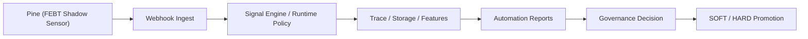

# BEST_FEBT_SYSTEM_ROLLOUT_PLAN

- 제정: 2026-03-29
- 상태: PROPOSED
- 목적: `BEST/FEBT`를 Pine에서 서버, 자동화, 운영 승격까지 실제 시스템에 도입하기 위한 실행 로드맵 고정
- 연계 문서:
  - `/Users/jeongjaeyong/Projects/donbeolja/docs/BEST_MASTER_SPEC.md`
  - `/Users/jeongjaeyong/Projects/donbeolja/docs/BEST_IMPLEMENTATION_FRAMEWORK.md`
  - `/Users/jeongjaeyong/Projects/donbeolja/docs/BEST_FEBT_WEEKLY_TUNING_POLICY.md`
  - `/Users/jeongjaeyong/Projects/donbeolja/docs/BEST_SELF_EVOLUTION_MASTER_SPEC.md`
  - `/Users/jeongjaeyong/Projects/donbeolja/docs/BEST_SELF_EVOLUTION_WORK_BREAKDOWN.md`
  - `/Users/jeongjaeyong/Projects/donbeolja/docs/BEST_FEBT_INTERFACE_SPEC.md`
  - `/Users/jeongjaeyong/Projects/donbeolja/docs/FEBT_PHASE0_MEASUREMENT_PLAN.md`
  - `/Users/jeongjaeyong/Projects/donbeolja/docs/FEBT_PHASE0_BASELINE_SNAPSHOT_2026W13.md`
  - `/Users/jeongjaeyong/Projects/donbeolja/docs/FEBT_OVERLAP_MATRIX_SCHEMA.md`
  - `/Users/jeongjaeyong/Projects/donbeolja/docs/FEBT_BRIDGE_LATENCY_BUDGET.md`
  - `/Users/jeongjaeyong/Projects/donbeolja/docs/FEBT_PHASE1_PINE_FIELD_SPEC.md`
  - `/Users/jeongjaeyong/Projects/donbeolja/docs/FEBT_PINE_INTRODUCTION_PLAN.md`
  - `/Users/jeongjaeyong/Projects/donbeolja/docs/FEBT_FAILSAFE_POLICY.md`

## 목적

이 문서는 `BEST/FEBT`를 아래 순서로 실제 시스템에 넣는 계획을 정의한다.

1. Pine 센서화
2. 서버 shadow 수집
3. 자동화 반증 체계 연결
4. `SOFT` 제한 적용
5. `HARD` 승격

핵심 원칙:

1. `SHADOW` 이전에는 live signal semantics를 바꾸지 않는다.
2. `SOFT` 이전에는 `LONG / SHORT` count를 바꾸지 않는다.
3. `HARD` 이전에는 approved market/timeframe 밖으로 확장하지 않는다.

## 최종 목표

도입의 성공 조건은 아래 4개다.

1. 승인 시장군 기준 `win_rate >= 0.60`
2. `count_ratio_global >= 1.00`
3. `avg_ret_net`, `expectancy`, `tp1_first_rate` non-inferior
4. bridge latency / reject / duplicate / stale가 timing 의미를 깨지 않음

## 적용 범위

### Pine

대상 파일:

1. `/Users/jeongjaeyong/Projects/donbeolja/code/donbeolja_v6.0.3.0.pine.txt`

도입 범위:

1. `febt_*` 내부 계산
2. payload emission
3. debug 표시

비도입 범위:

1. account risk
2. reject / partial fill handling
3. server-side dedupe

### 서버

대상 파일:

1. `/Users/jeongjaeyong/Projects/donbeolja/src/routes/webhook.routes.js`
2. `/Users/jeongjaeyong/Projects/donbeolja/src/engine/paperUpbitRunner.js`
3. `/Users/jeongjaeyong/Projects/donbeolja/src/services/waitOneBarPolicy.js`
4. `/Users/jeongjaeyong/Projects/donbeolja/src/services/evTp1Probability.js`
5. `/Users/jeongjaeyong/Projects/donbeolja/src/utils/filterFeatureBuckets.js`

도입 범위:

1. webhook schema acceptance
2. shadow ledger 저장
3. FEBT vs legacy WAIT disagreement logging
4. `SOFT/HARD` authority gating

### 자동화/리포트

대상 파일:

1. `/Users/jeongjaeyong/Projects/donbeolja/scripts/automation-weekly-filter-governance.js`
2. `/Users/jeongjaeyong/Projects/donbeolja/scripts/automation-objective-supervisor.js`
3. `/Users/jeongjaeyong/Projects/donbeolja/scripts/automation-hourly-guard.js`
4. `/Users/jeongjaeyong/Projects/donbeolja/scripts/report-ev-gate-impact.js`
5. `/Users/jeongjaeyong/Projects/donbeolja/src/routes/dashboard.home.routes.js`
6. `/Users/jeongjaeyong/Projects/donbeolja/src/routes/report.improvement-pack.routes.js`
7. `/Users/jeongjaeyong/Projects/donbeolja/src/views/settings.ejs`

도입 범위:

1. phase distribution
2. overlap matrix
3. disagreement attribution
4. replacement accounting
5. 운영 메시지 승격 게이트 표시

## 상위 데이터 흐름

## 도입 원칙

1. `BEST`는 기존 1~5차를 덮어쓰지 않고 점진적으로 흡수한다.
2. `FEBT`는 first release에서 `5차 WAIT`의 shadow comparator다.
3. `L5 행동층`은 기존 서버 policy를 재정의한 이름이며, first release에서 신규 엔진 구현은 하지 않는다.
4. `Pine -> 서버 -> 자동화` 순서로만 승격한다.
5. 한 phase를 통과하지 못하면 다음 phase로 넘어가지 않는다.

## Phase 0. Baseline Freeze

목표:

1. 기존 1~5차 결과를 기준선으로 고정
2. 승인 시장군/시간대/표본/latency budget을 고정

작업:

1. `BEST_MASTER_SPEC` 기준 승인 시장군 고정
2. `FEBT_THRESHOLD_CALIBRATION_PROTOCOL` seed 값 고정
3. legacy WAIT 기준 성과 baseline 추출
4. `signals_dropped`, `fills`, `trades`, `features_json` 기반 측정 가능성 확인

산출물:

1. baseline KPI snapshot
2. overlap matrix schema
3. latency budget sheet

승인 조건:

1. `win/count/expectancy/latency` baseline이 문서화됨
2. Phase 1 payload field가 frozen 상태

실패 시:

1. `SHADOW` 구현 보류

## Phase 1. Pine SHADOW Sensor

목표:

1. Pine가 `febt_*`를 계산하되 live signal semantics는 바꾸지 않음

대상:

1. `/Users/jeongjaeyong/Projects/donbeolja/code/donbeolja_v6.0.3.0.pine.txt`

작업:

1. `grp_febt` 입력 추가
2. `FEBT_MICROSTRUCTURE_INPUT_SPEC` 기반 중간 입력 계산
3. `FEBT_SCORE_CALCULATION_SPEC` 기반 score 계산
4. `FEBT_PHASE1_PINE_FIELD_SPEC` 기반 `phase`, `calc_ok`, `calc_reason` 계산
5. alert payload에 `febt_*` shadow field 추가
6. chart 표시용 debug toggle 추가

불변 조건:

1. `SHADOW`에서는 `LONG / SHORT` pulse 변화 `0`
2. `EARLY / CORE` 의미 불변
3. Pine이 활성 필터를 우회하지 않음

산출물:

1. Pine payload sample
2. Pine screenshot / debug example
3. shadow-only release note

승인 조건:

1. Pine compile pass
2. payload schema pass
3. signal count delta = `0`

롤백:

1. `febt_mode = OFF`
2. `febt_payload_enable = false`

## Phase 2. Server Shadow Ingest

목표:

1. Pine가 보낸 `febt_*`를 서버가 안전하게 수신, 저장, 비교

대상:

1. `/Users/jeongjaeyong/Projects/donbeolja/src/routes/webhook.routes.js`
2. `/Users/jeongjaeyong/Projects/donbeolja/src/engine/paperUpbitRunner.js`
3. `/Users/jeongjaeyong/Projects/donbeolja/src/utils/filterFeatureBuckets.js`

작업:

1. webhook에서 `febt_*` schema parse
2. fail-safe policy 적용
3. runtime trace에 `febt_phase`, `febt_edge`, `febt_calc_reason` 저장
4. legacy WAIT verdict와 `disagreement_reason` 저장
5. `features_json`와 report feature signature에 FEBT 필드 추가

불변 조건:

1. `febt_calc_ok=false`여도 legacy flow 유지
2. `SHADOW`에서는 action policy 변경 없음
3. missing payload는 `payload_missing`으로만 기록

산출물:

1. shadow ledger rows
2. disagreement examples
3. failure handling sample cases

승인 조건:

1. parse failure가 live action에 영향 없음
2. shadow rows 누락률 허용 범위 이내
3. duplicate / stale / reject trace에 FEBT field 보존

롤백:

1. 서버에서 `febt_*` 무시
2. feature write 비활성

## Phase 3. Automation and Governance

목표:

1. 자동화가 `FEBT`를 반증 가능하게 만들기

대상:

1. `/Users/jeongjaeyong/Projects/donbeolja/scripts/automation-weekly-filter-governance.js`
2. `/Users/jeongjaeyong/Projects/donbeolja/scripts/automation-objective-supervisor.js`
3. `/Users/jeongjaeyong/Projects/donbeolja/scripts/automation-hourly-guard.js`
4. `/Users/jeongjaeyong/Projects/donbeolja/scripts/report-ev-gate-impact.js`
5. `/Users/jeongjaeyong/Projects/donbeolja/src/routes/report.improvement-pack.routes.js`
6. `/Users/jeongjaeyong/Projects/donbeolja/src/routes/dashboard.home.routes.js`

작업:

1. `phase distribution` 집계
2. `legacy WAIT vs FEBT` overlap matrix
3. `saved_loss / missed_gain` 집계
4. `replacement_ratio`, `count_ratio_global` 집계
5. `latency / duplicate / reject / stale` 영향 집계
6. 텔레그램/대시보드에 `SHADOW verdict` 노출

산출물:

1. weekly governance FEBT section
2. objective supervisor approval note
3. hourly guard anomaly note
4. dashboard/reports FEBT cards

승인 조건:

1. 승인 시장군 기준 56d report 생성 가능
2. saved loss / missed gain / replacement accounting 재현 가능
3. `FIRE`, `ARMED`, `LATE` phase가 성과적으로 분리되기 시작함

롤백:

1. automation display만 비활성
2. ingest/storage는 유지 가능

## Phase 4. SOFT Canary

목표:

1. `FEBT`를 제한적 timing advisory로 사용

권한:

1. `febt_authority = TIMING_ADVISORY`
2. `L1~L3` verdict를 뒤집지 않음
3. `LATE`는 aggressive add 차단 또는 defer hint
4. `ARMED`는 one-bar defer hint
5. `FIRE`는 pass 우선

대상 시장:

1. `BTCUSDT`
2. `ETHUSDT`
3. `BNBUSDT`
4. `XRPUSDT`
5. `SOLUSDT`
6. `AXSUSDT`
7. `DOGEUSDT`

대상 시간대:

1. `15m`
2. `1h`

승인 조건:

1. `FIRE` win rate `>= 0.52`
2. `replacement_ratio >= 0.80`
3. `count_ratio_global >= 1.00`
4. `avg_ret_net` non-inferior
5. latency budget 이내

추가 가드:

1. auto-stop은 `BEST_OPERATIONAL_GUARDS`를 따른다.
2. count excess 발생 시 `SOFT -> SHADOW` 후보로 격하

롤백:

1. `SOFT -> SHADOW`
2. legacy WAIT 전면 복귀

## Phase 5. HARD Promotion

목표:

1. `FEBT`를 `5차 WAIT`의 주판정으로 승격

권한:

1. `febt_authority = WAIT_PRIMARY`
2. fail-safe는 항상 legacy WAIT fallback 유지
3. legacy WAIT 완전 삭제는 금지

승인 조건:

1. `56d approved aggregated win_rate >= 0.60`
2. `100-signal rolling win_rate >= 0.60`
3. `95% Wilson lower bound >= 0.55`
4. `replacement_ratio >= 0.90`
5. `count_ratio_global >= 1.00`
6. `tp1_first_rate`, `expectancy`, `avg_ret_net` non-inferior
7. objective supervisor + Octopus + 운영자 승인

롤백:

1. `HARD -> SOFT`
2. 연속 이상 시 `SOFT -> SHADOW`
3. legacy WAIT는 삭제하지 않고 dormant fallback로 유지

## 작업 스트림

### Stream A. Pine

산출물:

1. `febt_mode`
2. `febt_*` payload
3. chart debug row

완료 기준:

1. compile pass
2. count delta `0`
3. payload sample 확인

### Stream B. Ingest / Runtime

산출물:

1. schema parse
2. trace logging
3. disagreement attribution

완료 기준:

1. fail-safe pass
2. shadow rows 보존

### Stream C. Analytics / Automation

산출물:

1. overlap matrix
2. replacement accounting
3. latency/reject impact

완료 기준:

1. weekly/objective/hourly 리포트에 동일 용어로 표시

### Stream D. UI / Operator

산출물:

1. settings 설명
2. report cards
3. operational runbook link

완료 기준:

1. 운영자가 `SHADOW/SOFT/HARD` 상태를 혼동하지 않음

## 리스크

1. `FEBT`가 legacy WAIT와 사실상 동일해질 위험
2. `FIRE`가 chase continuation과 구분되지 않을 위험
3. bridge latency로 `FIRE`가 실제 체결 시점엔 `LATE`가 될 위험
4. `LATE` 차단이 signal count를 깎을 위험
5. approved market 밖으로 의미 없는 일반화가 일어날 위험

## 체크리스트

### Phase 1 전

1. score spec 존재
2. microstructure input spec 존재
3. threshold calibration protocol 존재
4. failsafe policy 존재

### Phase 2 전

1. Pine payload fields 고정
2. webhook parse path 설계 완료
3. trace storage path 설계 완료

### Phase 3 전

1. overlap matrix schema 존재
2. replacement measurement spec 존재
3. governance messages 용어 통일

### Phase 4 전

1. 56d shadow 결과 확보
2. count floor pass
3. saved loss > missed gain 경향 확인

### Phase 5 전

1. 56d / 100-signal / Wilson 기준 pass
2. objective supervisor 승인
3. Octopus 승인
4. 운영자 수동 승인

## 한 줄 결론

`BEST/FEBT` 도입은 Pine에 새 신호를 넣는 작업이 아니라, `Pine shadow sensor -> 서버 ingest -> 자동화 반증 -> SOFT advisory -> HARD wait-primary` 순서로 단계 승격하는 시스템 롤아웃 작업이다.
