# BEST_PINE_TO_SELF_EVOLUTION_SYSTEM_MAP

- 제정: 2026-03-31
- 상태: ACTIVE
- 목적:
  - `Pine -> webhook -> 1~5차 서버 실행 -> 저장/리포트 -> BEST/FEBT 감독 -> self-evolution -> Codex/Claude authority -> 배포/수동 paste -> live confirm`
    까지 전체 시스템을 한 문서에서 이해할 수 있게 정리한다.
  - 기존 세부 SSOT 문서를 대체하지 않고, 어떤 문서가 어디를 책임지는지 상위 지도 역할을 한다.
- 연계 문서:
  - `/Users/jeongjaeyong/Projects/donbeolja/docs/PINE_AND_FILTER_STAGE_ROLES.md`
  - `/Users/jeongjaeyong/Projects/donbeolja/docs/BEST_FEBT_SYSTEM_ROLLOUT_PLAN.md`
  - `/Users/jeongjaeyong/Projects/donbeolja/docs/BEST_SERVER_CANONICAL_ENGINE_MIGRATION_PLAN.md`
  - `/Users/jeongjaeyong/Projects/donbeolja/docs/BEST_SELF_EVOLUTION_MASTER_SPEC.md`
  - `/Users/jeongjaeyong/Projects/donbeolja/docs/BEST_SELF_EVOLUTION_DEPLOYMENT_AUTOPILOT_SPEC.md`
  - `/Users/jeongjaeyong/Projects/donbeolja/docs/BEST_OPERATIONAL_GUARDS.md`
  - `/Users/jeongjaeyong/Projects/donbeolja/docs/CLAUDE_FULL_SYSTEM_QUALITY_AUDIT_PROMPT.md`

## 1. 한 줄 정의

이 시스템은 `Pine가 신호 품질의 원천(SSOT)`을 만들고, `서버가 실행/드롭/리스크/실행 품질`을 책임지며, `BEST/FEBT 자동화와 self-evolution`이 그 결과를 학습해서 다음 Pine/정책 변경 후보를 만들고, `Codex + Claude ensemble`이 마지막 외부 권위로 승격을 통제하는 구조다.

## 2. 시스템 최상위 흐름

```mermaid
flowchart LR
  A["Pine<br/>LONG/SHORT, EARLY/CORE, FIXED"] --> B["Webhook Ingest<br/>strategy gate / schema / integrity"]
  B --> C["Runtime Engine<br/>1~5차 + FEBT + execution"]
  C --> D["Signals / Intents / Fills / Trades / Drops"]
  D --> E["Governance / Objective Supervisor / Canary"]
  E --> F["BEST Self-Evolution Loop"]
  F --> G["Codex + Claude Authority"]
  G --> H["Deployment Plan / Stage Autopilot"]
  H --> I["Manual Pine Paste"]
  I --> J["Live Signal Confirmation"]
  J --> K["Applied Runtime / Next Cycle Feedback"]
```

## 3. 용어 사전

1. `LONG / SHORT`
   - 외부 live 엔트리 이벤트명
   - 현재 운영 웹훅과 runtime은 이 이벤트명만 메인 엔트리로 쓴다.
2. `EARLY / CORE`
   - Pine 내부 source timing band
   - 외부 이벤트명이 아니라, `LONG / SHORT`가 어떤 timing 성격인지 설명하는 band다.
3. `FIXED`
   - 현재 active LONG/SHORT 수량 profile 이름
   - 다만 현재 구현상 `EV` 감산은 억제되지만, `AI/CROSS-ASSET` 같은 다른 reduce 경로는 여전히 최종 수량을 줄일 수 있다.
4. `FEBT`
   - `5차 WAIT 타이밍층`의 Pine-native timing core
   - 초기엔 `SHADOW`, 이후 `SOFT/HARD` 승격 대상으로 본다.
5. `recommended target`
   - 현재 self-evolution이 가장 유망하다고 보는 다음 후보
6. `applied origin`
   - 현재 실제로 붙여넣어 운영 중인 Pine가 어떤 candidate 출처에서 왔는지
7. `authority bypass`
   - Pine는 운영에 반영됐지만, `CODEX_CLAUDE_ENSEMBLE`의 정식 `PROMOTE` 없이 적용된 상태

## 4. Pine 레이어

### 4.1 역할

Pine는 아래를 책임진다.

1. `LONG / SHORT` 신호 생성
2. `EARLY / CORE` timing band 계산
3. `regime / score / confidence / posterior / wave / EV` 품질 번들 계산
4. `FEBT phase / edge / calc_ok / calc_reason` 같은 timing telemetry 생성
5. alert payload에 `strategy_id`, `trace_payload_version`, `features_json.*`를 싣는 일

핵심 문서:

1. `/Users/jeongjaeyong/Projects/donbeolja/docs/PINE_AND_FILTER_STAGE_ROLES.md`
2. `/Users/jeongjaeyong/Projects/donbeolja/docs/FEBT_PINE_INTRODUCTION_PLAN.md`
3. `/Users/jeongjaeyong/Projects/donbeolja/docs/FEBT_PHASE1_PINE_FIELD_SPEC.md`

핵심 파일:

1. `/Users/jeongjaeyong/Projects/donbeolja/code/donbeolja.pine.txt`
2. `/Users/jeongjaeyong/Projects/donbeolja/code/donbeolja_latest_generated.pine.txt`
3. `/Users/jeongjaeyong/Projects/donbeolja/code/donbeolja_v*.pine.txt`

### 4.2 Pine가 하지 않는 일

1. webhook dedupe
2. exchange reject 처리
3. partial fill 복구
4. 계좌 리스크 한도 강제
5. 최종 주문 실행
6. self-evolution 후보 승격

## 5. 서버 실행 레이어

### 5.1 진입점

핵심 파일:

1. `/Users/jeongjaeyong/Projects/donbeolja/src/routes/webhook.routes.js`
2. `/Users/jeongjaeyong/Projects/donbeolja/src/engine/paperUpbitRunner.js`

웹훅에서 먼저 보는 것:

1. `strategy_id` 허용 여부
2. payload schema / integrity
3. live/prepared/applied runtime state
4. duplicate/stale 여부

현재 중요한 사실:

1. 새 Pine를 붙여넣은 뒤 들어오는 webhook은 `env`만이 아니라 `self_evolution runtime state`와 `prepared target`까지 보고 허용한다.
2. 따라서 self-evolution이 준비한 다음 버전은 `false STRATEGY_ID_MISMATCH`로 막히지 않아야 한다.

### 5.2 1~5차 필터

현재 역할은 `/Users/jeongjaeyong/Projects/donbeolja/docs/PINE_AND_FILTER_STAGE_ROLES.md`가 SSOT다.

정리하면:

1. `1차`
   - payload 무결성 / schema / stale / parse / 안전 가드
2. `2차`
   - AI usable / AI block / 기본 허용 여부
3. `3차`
   - 시황 방향 prior / sizing
4. `4차`
   - TP1 도달 확률 기반 final sizing / kill
5. `5차`
   - 늦은 진입을 한 봉 연기할지 판단

### 5.3 현재 수량 체계에서 주의할 점

현재 `FIXED`는 이름 그대로 절대 고정 체결 수량을 뜻하지 않는다.

현재 사실:

1. `EV` 감산은 `FIXED`에서 억제된다.
2. 하지만 `AI/CROSS-ASSET`, `commission gate`, `MDD reduce` 같은 다른 reduce 경로는 여전히 final qty를 줄일 수 있다.
3. 따라서 “Pine의 FIXED = 항상 프리리얼 고정 수량 체결”은 현재 구현 사실과 다르다.

이 문서는 이상 상태가 아니라 현재 시스템 사실을 기록한다.

## 6. 저장/관측 레이어

핵심 저장 산출물:

1. `/Users/jeongjaeyong/Projects/donbeolja/ops/daily/cache/firestore_recent/signals.json`
2. `/Users/jeongjaeyong/Projects/donbeolja/ops/daily/cache/firestore_recent/signals_dropped.json`
3. `/Users/jeongjaeyong/Projects/donbeolja/ops/daily/cache/firestore_recent/order_intents_paper.json`
4. `/Users/jeongjaeyong/Projects/donbeolja/ops/daily/cache/firestore_recent/fills_paper.json`
5. `/Users/jeongjaeyong/Projects/donbeolja/ops/daily/cache/firestore_recent/trades_paper.json`
6. `/Users/jeongjaeyong/Projects/donbeolja/ops/daily/cache/firestore_recent/webhook_ledger.json`

여기서 보는 것:

1. 실제 신호가 왔는지
2. 어디서 드롭됐는지
3. intent가 만들어졌는지
4. fill이 체결됐는지
5. 수량이 어느 단계에서 줄었는지
6. `features_json.strategy_id`, `entry_qty_profile`, `ev_gate_*`, `ai_signal.*`, `febt_*`가 무엇인지

## 7. BEST/FEBT 감독 레이어

### 7.1 핵심 감독자

핵심 파일:

1. `/Users/jeongjaeyong/Projects/donbeolja/scripts/automation-objective-supervisor.js`
2. `/Users/jeongjaeyong/Projects/donbeolja/scripts/automation-weekly-filter-governance.js`
3. `/Users/jeongjaeyong/Projects/donbeolja/scripts/automation-filter-shadow-canary.js`

핵심 산출물:

1. `/Users/jeongjaeyong/Projects/donbeolja/ops/daily/objective_supervisor_latest.json`
2. `/Users/jeongjaeyong/Projects/donbeolja/ops/daily/weekly_filter_governance_latest.json`
3. `/Users/jeongjaeyong/Projects/donbeolja/ops/daily/filter_shadow_canary_latest.json`
4. `/Users/jeongjaeyong/Projects/donbeolja/ops/daily/febt_phase0_baseline_latest.json`

### 7.2 여기서 하는 일

1. 성과가 목표에 맞는지 계산
2. `MONTHLY_TARGET_NOT_MET`, `OBJECTIVE_NOT_MET`, `LATENCY_FAIL` 같은 blocker 계산
3. canary drift / system approvals / FEBT phase baseline 추적
4. self-evolution에 “어떤 문제가 우선인지”를 전달

### 7.3 FEBT 문서 군

FEBT는 아래 문서들이 세부 SSOT다.

1. `/Users/jeongjaeyong/Projects/donbeolja/docs/BEST_FEBT_SYSTEM_ROLLOUT_PLAN.md`
2. `/Users/jeongjaeyong/Projects/donbeolja/docs/FEBT_CONCEPT.md`
3. `/Users/jeongjaeyong/Projects/donbeolja/docs/FEBT_PHASE0_MEASUREMENT_PLAN.md`
4. `/Users/jeongjaeyong/Projects/donbeolja/docs/FEBT_PINE_INTRODUCTION_PLAN.md`
5. `/Users/jeongjaeyong/Projects/donbeolja/docs/BEST_OPERATIONAL_GUARDS.md`

## 8. Self-Evolution 레이어

### 8.1 상위 역할

핵심 문서:

1. `/Users/jeongjaeyong/Projects/donbeolja/docs/BEST_SELF_EVOLUTION_MASTER_SPEC.md`
2. `/Users/jeongjaeyong/Projects/donbeolja/docs/BEST_SELF_EVOLUTION_DATASET_SPEC.md`
3. `/Users/jeongjaeyong/Projects/donbeolja/docs/BEST_SELF_EVOLUTION_OBJECTIVE_SCORE_SPEC.md`
4. `/Users/jeongjaeyong/Projects/donbeolja/docs/BEST_SELF_EVOLUTION_ATTRIBUTION_SPEC.md`
5. `/Users/jeongjaeyong/Projects/donbeolja/docs/BEST_SELF_EVOLUTION_CANARY_SPEC.md`
6. `/Users/jeongjaeyong/Projects/donbeolja/docs/BEST_SELF_EVOLUTION_DEPLOYMENT_AUTOPILOT_SPEC.md`

### 8.2 실제 루프

실행 파일:

1. `/Users/jeongjaeyong/Projects/donbeolja/scripts/automation-self-evolution-loop.js`

현재 루프 단계:

1. `dataset`
2. `objective_seed`
3. `objective`
4. `attribution`
5. `candidates`
6. `replay`
7. `filter_shadow_canary`
8. `ev_gate_rescue`
9. `canary`
10. `memory`
11. `deployment_guards`
12. `weight_tuning`
13. `codex_patch_engine`
14. `claude_patch_engine`
15. `authority_ensemble`
16. `deployment_plan`
17. `objective_integrated`
18. `objective_final`
19. `loop_monitor`
20. `stage_autopilot`

### 8.3 각 단계의 의미

1. `dataset`
   - 최근 signals / drops / intents / fills / trades를 학습 row로 정리
2. `objective`
   - 전역/시장별 목적함수 계산
3. `attribution`
   - 손실, fallback, late, void, replacement 문제 분해
4. `candidates`
   - 자동 tightening / regime / tuning 후보 생성
5. `replay`
   - offline delta 검증
6. `canary`
   - 시장별 wave/stage 적용 가능성 계산
7. `memory`
   - 실패 후보 재시도 금지와 TTL 관리
8. `deployment_guards`
   - promotion 가능 여부 점검
9. `codex/claude/ensemble`
   - 외부 권위 심사
10. `deployment_plan`
   - 다음 Pine 파일, 현재 적용 상태, 수동 paste 필요 여부 정리
11. `stage_autopilot`
   - handoff 파일과 rollout 상태 갱신

## 9. 외부 권위 레이어

### 9.1 현재 구조

권위 owner는 현재 `CODEX_CLAUDE_ENSEMBLE`이다.

핵심 파일:

1. `/Users/jeongjaeyong/Projects/donbeolja/scripts/automation-codex-weekly-patch-engine.js`
2. `/Users/jeongjaeyong/Projects/donbeolja/scripts/automation-claude-weekly-patch-engine.js`
3. `/Users/jeongjaeyong/Projects/donbeolja/scripts/report-self-evolution-authority-ensemble.js`
4. `/Users/jeongjaeyong/Projects/donbeolja/src/utils/selfEvolutionAuthorityEnsemble.js`

핵심 산출물:

1. `/Users/jeongjaeyong/Projects/donbeolja/ops/daily/codex_weekly_patch_engine_latest.json`
2. `/Users/jeongjaeyong/Projects/donbeolja/ops/daily/claude_weekly_patch_engine_latest.json`
3. `/Users/jeongjaeyong/Projects/donbeolja/ops/daily/best_self_evolution_self_evolution_authority_latest.json`

### 9.2 현재 해석 규칙

1. 자동 promotion은 `Codex + Claude` 합의 없는 상태에서 통과하면 안 된다.
2. 이미 수동으로 적용된 Pine는 `authority bypass` 상태로 별도 표기한다.
3. 따라서 applied 상태는 두 종류가 있다.
   - `APPLIED_ACTIVE`
   - `APPLIED_ACTIVE_AUTHORITY_BYPASS`
4. 과거 artifact는 레거시 호환 상태로 남을 수 있다.
   - `APPLIED_CONFIRMED`
   - `APPLIED_CONFIRMED_AUTHORITY_BYPASS`

## 10. 배포 상태 머신

핵심 파일:

1. `/Users/jeongjaeyong/Projects/donbeolja/src/utils/bestSelfEvolutionDeploymentPlan.js`
2. `/Users/jeongjaeyong/Projects/donbeolja/scripts/report-best-self-evolution-deployment-plan.js`
3. `/Users/jeongjaeyong/Projects/donbeolja/scripts/automation-stage-autopilot.js`
4. `/Users/jeongjaeyong/Projects/donbeolja/src/utils/selfEvolutionRuntimeState.js`
5. `/Users/jeongjaeyong/Projects/donbeolja/scripts/ack-self-evolution-manual-paste.js`

주요 상태:

1. `HOLD`
2. `PREPARE_PROMOTION`
3. `READY_FOR_MANUAL_PASTE`
4. `APPLIED_PENDING_BUNDLE_ACTIVATION`
5. `APPLIED_ACTIVE`
6. `APPLIED_PENDING_BUNDLE_ACTIVATION_AUTHORITY_BYPASS`
7. `APPLIED_ACTIVE_AUTHORITY_BYPASS`
8. `PREPARE_ROLLBACK`
9. `READY_FOR_MANUAL_ROLLBACK`

레거시 호환 상태:

1. `APPLIED_PENDING_SIGNAL_CONFIRMATION`
2. `APPLIED_CONFIRMED`
3. `APPLIED_PENDING_SIGNAL_CONFIRMATION_AUTHORITY_BYPASS`
4. `APPLIED_CONFIRMED_AUTHORITY_BYPASS`

### 10.1 실제 흐름

1. self-evolution이 다음 Pine file path를 준비한다.
2. 사람이 TradingView에 붙여넣는다.
3. `ack-self-evolution-manual-paste.js`가 runtime state를 기록한다.
4. 첫 `LONG/SHORT` live 신호 또는 live dropped 신호가 들어오면 strategy id로 confirm한다.
5. deployment plan / loop monitor / supervisor가 새 applied 상태를 반영한다.

### 10.2 current applied vs recommended target

현재 시스템은 아래 둘을 분리해서 기록해야 한다.

1. `applied_origin_candidate_id`
   - 현재 실제 운영 중인 Pine의 출처
2. `recommended_target_candidate_id`
   - 지금 추천되는 다음 self-evolution target

이 둘을 섞으면 rollback, attribution, memory, 감사 리포트가 꼬인다.

## 11. 현재 수동 경계

지금도 사람이 반드시 하는 일:

1. TradingView Pine 붙여넣기

사람이 원하면 개입할 수 있지만, 시스템이 기본적으로 자동화하는 일:

1. prepared file 생성
2. runtime/version sync
3. webhook strategy gate 확장
4. applied/live signal confirmation
5. objective/canary/self-evolution artifact 갱신

## 12. 운영자가 지금 봐야 할 핵심 파일

### 12.1 신호 품질/실행

1. `/Users/jeongjaeyong/Projects/donbeolja/ops/daily/cache/firestore_recent/signals.json`
2. `/Users/jeongjaeyong/Projects/donbeolja/ops/daily/cache/firestore_recent/signals_dropped.json`
3. `/Users/jeongjaeyong/Projects/donbeolja/ops/daily/cache/firestore_recent/order_intents_paper.json`
4. `/Users/jeongjaeyong/Projects/donbeolja/ops/daily/cache/firestore_recent/fills_paper.json`

### 12.2 감독/가드

1. `/Users/jeongjaeyong/Projects/donbeolja/ops/daily/objective_supervisor_latest.json`
2. `/Users/jeongjaeyong/Projects/donbeolja/ops/daily/weekly_filter_governance_latest.json`
3. `/Users/jeongjaeyong/Projects/donbeolja/ops/daily/filter_shadow_canary_latest.json`
4. `/Users/jeongjaeyong/Projects/donbeolja/ops/daily/febt_phase0_baseline_latest.json`

### 12.3 self-evolution / authority / 배포

1. `/Users/jeongjaeyong/Projects/donbeolja/ops/daily/best_self_evolution_loop_run_latest.json`
2. `/Users/jeongjaeyong/Projects/donbeolja/ops/daily/best_self_evolution_deployment_plan_latest.json`
3. `/Users/jeongjaeyong/Projects/donbeolja/ops/daily/best_self_evolution_loop_monitor_latest.json`
4. `/Users/jeongjaeyong/Projects/donbeolja/ops/daily/best_self_evolution_self_evolution_authority_latest.json`
5. `/Users/jeongjaeyong/Projects/donbeolja/ops/daily/self_evolution_manual_paste_ack_latest.json`

## 13. 현재 시스템 사실상 중요 주의점

1. `FIXED = 무조건 프리리얼 체결 수량`은 아니다.
   - 현재는 `EV` 감산만 억제되고, 다른 reduce path는 남아 있다.
2. `authority verdict = HOLD`인데 applied가 존재할 수 있다.
   - 이 경우는 버그가 아니라 `AUTHORITY_BYPASS` 상태다.
3. self-evolution report의 `latest` alias는 같은 cycle env로 써야 원자적으로 정렬된다.
4. `objective HOLD`와 `applied confirmed`는 동시에 가능하다.
   - 하나는 운영 성과 상태이고, 다른 하나는 버전 적용 확인 상태다.

## 14. 권장 문서 읽기 순서

처음 보는 사람 기준:

1. 이 문서
2. `/Users/jeongjaeyong/Projects/donbeolja/docs/PINE_AND_FILTER_STAGE_ROLES.md`
3. `/Users/jeongjaeyong/Projects/donbeolja/docs/BEST_OPERATIONAL_GUARDS.md`
4. `/Users/jeongjaeyong/Projects/donbeolja/docs/FEBT_PINE_INTRODUCTION_PLAN.md`
5. `/Users/jeongjaeyong/Projects/donbeolja/docs/BEST_FEBT_SYSTEM_ROLLOUT_PLAN.md`
6. `/Users/jeongjaeyong/Projects/donbeolja/docs/BEST_SELF_EVOLUTION_MASTER_SPEC.md`
7. `/Users/jeongjaeyong/Projects/donbeolja/docs/BEST_SELF_EVOLUTION_DEPLOYMENT_AUTOPILOT_SPEC.md`

## 15. 한 줄 결론

이 저장소의 핵심은 “Pine가 신호 품질을 만들고, 서버가 실행과 리스크를 책임지고, BEST/FEBT와 self-evolution이 그 결과를 학습해서 다음 Pine/정책을 만들며, 최종 승격은 Codex/Claude ensemble이 통제한다”는 점이다.
