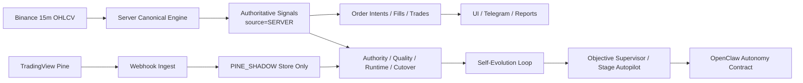

# BEST_PINE_TO_SELF_EVOLUTION_SYSTEM_MAP

- 제정: 2026-03-31
- 업데이트: 2026-04-03
- 상태: ACTIVE
- 목적:
  - 돈벌자 전체 구조를 `사용자 화면 -> 서버 신호 -> 실행 -> 감독 -> self-evolution -> autonomy contract` 순서로 한 문서에서 이해하게 한다.
  - Pine 중심 설명이 아니라 `서버 정본 전환 이후의 실제 구조`를 기준으로 정리한다.
- 연계 문서:
  - `/Users/jeongjaeyong/Projects/donbeolja/docs/SERVER_SIGNAL_AUTHORITY_SPEC.md`
  - `/Users/jeongjaeyong/Projects/donbeolja/docs/SERVER_SIGNAL_AUTHORITY_MIGRATION_CHECKLIST.md`
  - `/Users/jeongjaeyong/Projects/donbeolja/docs/SERVER_VS_PINE_SHADOW_COMPARISON_RUNBOOK.md`
  - `/Users/jeongjaeyong/Projects/donbeolja/docs/OPENCLAW_AUTONOMY_CONTRACT.md`
  - `/Users/jeongjaeyong/Projects/donbeolja/docs/BEST_SELF_EVOLUTION_MASTER_SPEC.md`

## 1. 한 줄 정의

돈벌자는 현재 `서버가 봉을 읽고 내부 정본 신호를 생성하며`, `Pine는 비교/시각화 shadow로 남는` 자동매매 시스템이다.

현재 source mode는 이미 `SERVER_PRIMARY`이며, Pine는 운영 정본이 아니다.

## 2. 현재 상태 요약

2026-04-03 15:00 latest 기준:

1. `runtime_status = READY`
2. `canonical_engine_source_mode = SERVER_PRIMARY`
3. `exec_tf = 15m`
4. `market_count = 7`
5. `server_signal_transition_progress_pct = 100`
6. `readiness_status = SERVER_PRIMARY_ACTIVE`
7. `promotion_gate_status = READY`
8. 남은 실질 blocker:
   - `objective_supervisor = HOLD`
   - `authority_state = PENDING`
   - `final_downstream_mismatch_n = 17`
9. `STRATEGY_GATE`는 `historical_only`로 비차단화됨

## 3. 최상위 흐름

## 4. 각 레이어의 책임

### 4.1 사용자 화면

역할:

1. 자산, 수익, 거래 결과를 먼저 보여준다.
2. 운영 artifact는 `전략상태`에서 읽게 한다.
3. 기본 화면은 서버 정본 신호만 보여준다.

현재 메뉴:

1. `홈`
2. `수익`
3. `입출금`
4. `거래기록`
5. `전략상태`
6. `설정`

핵심 파일:

1. `/Users/jeongjaeyong/Projects/donbeolja/src/views/home.ejs`
2. `/Users/jeongjaeyong/Projects/donbeolja/src/views/partials/topnav5.ejs`
3. `/Users/jeongjaeyong/Projects/donbeolja/src/utils/controlPlaneViewModels.js`

### 4.2 Pine 레이어

현재 역할:

1. 차트 상태 패널
2. EMA/보조선/마커
3. 비교용 shadow 신호 생성
4. 서버와의 drift 진단 근거 제공

현재 하지 않는 일:

1. 실행 정본 신호 생성
2. order intent 생성
3. Telegram 운영 알림 기준
4. execution authority

핵심 규칙:

1. webhook로 들어온 Pine 신호는 `source=PINE_SHADOW`
2. `authoritative=false`
3. 실행 체인에는 기본 진입하지 않는다.

### 4.3 서버 canonical engine

현재 역할:

1. 바이낸스 15분 봉 읽기
2. 내부 신호 생성
3. `source=SERVER`, `authoritative=true` 저장
4. order intent / fill / trade 연결
5. execution 품질과 cutover readiness 계산

핵심 파일:

1. `/Users/jeongjaeyong/Projects/donbeolja/src/scheduler/marketRunner.js`
2. `/Users/jeongjaeyong/Projects/donbeolja/src/engine/paperUpbitRunner.js`
3. `/Users/jeongjaeyong/Projects/donbeolja/src/routes/webhook.routes.js`
4. `/Users/jeongjaeyong/Projects/donbeolja/src/storage/signals.js`
5. `/Users/jeongjaeyong/Projects/donbeolja/src/storage/signalsQuery.js`

### 4.4 관측 artifact

현재 정본 artifact:

1. `/Users/jeongjaeyong/Projects/donbeolja/ops/daily/server_signal_runtime_latest.json`
2. `/Users/jeongjaeyong/Projects/donbeolja/ops/daily/server_signal_authority_latest.json`
3. `/Users/jeongjaeyong/Projects/donbeolja/ops/daily/server_signal_quality_latest.json`
4. `/Users/jeongjaeyong/Projects/donbeolja/ops/daily/server_signal_cutover_readiness_latest.json`

각 역할:

1. `runtime`: 실제 TF, 활성 마켓, source mode
2. `authority`: 정본/그림자 수와 parity 규모
3. `quality`: entry -> intent -> fill 품질
4. `cutover readiness`: coherence gate, blocker, 조치 힌트

### 4.5 self-evolution / autonomy

현재 읽는 것:

1. `server signal authority`
2. `server signal quality`
3. `server signal runtime`
4. `server signal cutover readiness`

연결 위치:

1. `loop monitor`
2. `objective supervisor`
3. `stage autopilot`
4. `openclaw autonomy contract`

## 5. 현재 전환 상태

### 5.1 이미 끝난 것

1. Pine webhook 신호의 `shadow-only` 강등
2. 기본 UI의 서버 정본 우선 표시
3. Telegram의 서버 정본 기준 전환
4. self-evolution / autopilot / autonomy contract로 server signal artifact 연결
5. `STRATEGY_GATE` historical-only 비차단화
6. `SERVER_PRIMARY_ACTIVE` 달성
7. cutover `promotion_gate_status = READY` 달성

### 5.2 아직 진행 중인 것

1. `EV_POLICY` drift 축소
2. `COOLDOWN_POLICY` drift 축소
3. autonomy verification rate 개선
4. objective recovery / authority pending 해소

## 6. 왜 아직 완전 자율 전환이 아닌가

현재 blocker는 source mode 부재가 아니라 autonomy와 성과 증거 부족이다.

주요 상태:

1. `canonical_engine_source_mode = SERVER_PRIMARY`
2. `readiness_status = SERVER_PRIMARY_ACTIVE`
3. `promotion_gate_status = READY`
4. `final_downstream_mismatch_n = 17`
5. `authority_state = PENDING`
6. `objective_supervisor = HOLD`

즉 지금은 `서버가 신호를 못 만들기 때문`이 아니라,
`서버 정본 이후 autonomy와 objective를 닫기 전 마지막 품질/검증 단계`다.

## 7. 사용자가 봐야 하는 흐름

1. `홈`
   - 자산 / 손익 / 최근 거래를 본다.
2. `수익`
   - 오늘, 7일, 30일, 6개월, 총 손익을 본다.
3. `거래기록`
   - 최근 신호, 주문, 실행 결과를 본다.
4. `전략상태`
   - 서버 정본 상태와 drift 상태를 본다.

즉 사용자 화면은 돈과 결과를 먼저 보여주고,
운영 판단은 `전략상태`에서 읽게 한다.

## 8. 운영자가 봐야 하는 흐름

1. `server_signal_runtime_latest.json`
2. `server_signal_authority_latest.json`
3. `server_signal_quality_latest.json`
4. `server_signal_cutover_readiness_latest.json`
5. `best_self_evolution_loop_monitor_latest.json`
6. `best_self_evolution_openclaw_autonomy_contract_latest.json`

이 6개를 보면 현재
- 서버 정본과 cutover coherence가 어디까지 왔는지
- autonomy가 왜 아직 pending인지
- 무엇을 먼저 조정해야 하는지
를 읽을 수 있다.

## 9. 지금의 최종 해석

돈벌자는 더 이상 `Pine가 신호를 만들고 서버가 받아 실행하는 시스템`으로만 설명하면 틀린다.

현재 더 정확한 설명은 아래다.

1. 서버가 15분 봉을 읽고 내부 정본 신호를 만든다.
2. Pine는 저장/비교/시각화 shadow로 남아 있다.
3. 운영 판단은 이미 서버 정본 artifact 기준으로 이동했다.
4. 남은 건 `SERVER_PRIMARY` 승격이 아니라, 그 이후 autonomy/verification/objective를 닫는 일이다.
