# BEST_PINE_TO_SELF_EVOLUTION_SYSTEM_MAP

- 제정: 2026-03-31
- 상태: ACTIVE
- 목적:
  - `Pine -> webhook -> 1~5차 서버 실행 -> 저장/리포트 -> BEST/FEBT 감독 -> self-evolution -> Codex/Claude authority -> 배포/bundle activation`
    까지 전체 시스템을 한 문서에서 이해할 수 있게 정리한다.
  - `OpenClaw cron / ops agent / Telegram transport`까지 포함한 운영 substrate의 현재 정본 경로를 같이 정리한다.
  - 기존 세부 SSOT 문서를 대체하지 않고, 어떤 문서가 어디를 책임지는지 상위 지도 역할을 한다.
- 연계 문서:
  - `/Users/jeongjaeyong/Projects/donbeolja/docs/PINE_AND_FILTER_STAGE_ROLES.md`
  - `/Users/jeongjaeyong/Projects/donbeolja/docs/BEST_FEBT_SYSTEM_ROLLOUT_PLAN.md`
  - `/Users/jeongjaeyong/Projects/donbeolja/docs/BEST_SERVER_CANONICAL_ENGINE_MIGRATION_PLAN.md`
  - `/Users/jeongjaeyong/Projects/donbeolja/docs/BEST_SELF_EVOLUTION_MASTER_SPEC.md`
  - `/Users/jeongjaeyong/Projects/donbeolja/docs/BEST_SELF_EVOLUTION_DEPLOYMENT_AUTOPILOT_SPEC.md`
  - `/Users/jeongjaeyong/Projects/donbeolja/docs/BEST_OPERATIONAL_GUARDS.md`
  - `/Users/jeongjaeyong/Projects/donbeolja/docs/CLAUDE_FULL_SYSTEM_QUALITY_AUDIT_PROMPT.md`

## 1. 한 줄 정의

이 시스템은 현재 `bundle-based hybrid canonical + OpenClaw ops substrate + autonomy governor` 상태다. 대부분 시장은 아직 `PINE_PRIMARY`로 움직이지만, 서버 canonical engine이 parity/provenance/probe/activation의 정본을 들고 있고, 일부 승인 시장은 `SERVER_PRIMARY` canary로 승격될 수 있다. 로컬 자동화 scheduler와 텔레그램 알림은 이제 `OpenClaw`가 정본이며, 목표 미달 시 회복 경로는 `OpenClaw autonomy contract`와 `objective recovery governor`가 판정한다.

## 2. 시스템 최상위 흐름

```mermaid
flowchart LR
  A["Pine<br/>LONG/SHORT, EARLY/CORE, FIXED"] --> B["Webhook Ingest<br/>strategy gate / schema / integrity"]
  B --> C["Runtime Engine<br/>1~5차 + FEBT + execution"]
  C --> D["Signals / Intents / Fills / Trades / Drops"]
  D --> E["Governance / Objective Supervisor / Canary"]
  E --> F["BEST Self-Evolution Loop"]
  F --> G["OpenClaw Autonomy Contract / Recovery Governor"]
  G --> H["Codex + Claude Authority"]
  H --> I["Deployment Plan / Stage Autopilot"]
  I --> J["Bundle Activation / Deployment Probe"]
  J --> K["Applied Runtime / Next Cycle Feedback"]
  O["OpenClaw Cron / Ops Agent / Telegram Delivery"] --> E
  O --> F
  O --> G
  I -. legacy .-> L["Optional Manual Pine Paste"]
```

## 3. 용어 사전

1. `LONG / SHORT`
   - 외부 live 엔트리 이벤트명
   - 현재 운영 웹훅과 runtime은 이 이벤트명만 메인 엔트리로 쓴다.
2. `EARLY / CORE`
   - Pine 내부 source timing band
   - 외부 이벤트명이 아니라, `LONG / SHORT`가 어떤 timing 성격인지 설명하는 band다.
3. `FIXED`
   - 현재 active LONG/SHORT 수량 profile 이름
   - 다만 현재 구현상 `EV` 감산은 억제되지만, `AI/CROSS-ASSET` 같은 다른 reduce 경로는 여전히 최종 수량을 줄일 수 있다.
4. `FEBT`
   - `5차 WAIT 타이밍층`의 Pine-native timing core
   - 초기엔 `SHADOW`, 이후 `SOFT/HARD` 승격 대상으로 본다.
5. `recommended target`
   - 현재 self-evolution이 가장 유망하다고 보는 다음 후보
6. `applied origin`
   - 현재 실제로 붙여넣어 운영 중인 Pine가 어떤 candidate 출처에서 왔는지
7. `authority bypass`
   - 과거 artifact에 남아 있던 legacy 용어다.
   - 최신 SSOT는 `authority_state=PENDING`과 `*_PENDING_AUTHORITY`만 쓴다.
8. `OpenClaw cron`
   - local automation scheduler의 현재 정본이다.
   - 기존 `launchd`는 fallback이 아니라 legacy diagnostic 대상으로만 남는다.
9. `OpenClaw-first Telegram`
   - 텔레그램 알림 전송은 repo alert path 기준으로 먼저 OpenClaw를 사용하고, 필요한 경우에만 direct API fallback을 탄다.

## 4. Pine 레이어

### 4.1 역할

Pine는 아래를 책임진다.

1. `LONG / SHORT` 신호 생성
2. `EARLY / CORE` timing band 계산
3. `regime / score / confidence / posterior / wave / EV` 품질 번들 계산
4. `FEBT phase / edge / calc_ok / calc_reason` 같은 timing telemetry 생성
5. alert payload에 `strategy_id`, `trace_payload_version`, `features_json.*`를 싣는 일

핵심 문서:

1. `/Users/jeongjaeyong/Projects/donbeolja/docs/PINE_AND_FILTER_STAGE_ROLES.md`
2. `/Users/jeongjaeyong/Projects/donbeolja/docs/FEBT_PINE_INTRODUCTION_PLAN.md`
3. `/Users/jeongjaeyong/Projects/donbeolja/docs/FEBT_PHASE1_PINE_FIELD_SPEC.md`

핵심 파일:

1. `/Users/jeongjaeyong/Projects/donbeolja/code/donbeolja.pine.txt`
2. `/Users/jeongjaeyong/Projects/donbeolja/code/donbeolja_latest_generated.pine.txt`
3. `/Users/jeongjaeyong/Projects/donbeolja/code/donbeolja_v*.pine.txt`

### 4.2 Pine가 하지 않는 일

1. webhook dedupe
2. exchange reject 처리
3. partial fill 복구
4. 계좌 리스크 한도 강제
5. 최종 주문 실행
6. self-evolution 후보 승격

## 5. 서버 실행 레이어

### 5.1 진입점

핵심 파일:

1. `/Users/jeongjaeyong/Projects/donbeolja/src/routes/webhook.routes.js`
2. `/Users/jeongjaeyong/Projects/donbeolja/src/engine/paperUpbitRunner.js`

웹훅에서 먼저 보는 것:

1. `strategy_id` 허용 여부
2. payload schema / integrity
3. live/prepared/applied runtime state
4. duplicate/stale 여부

현재 중요한 사실:

1. 새 Pine를 붙여넣은 뒤 들어오는 webhook은 `env`만이 아니라 `self_evolution runtime state`와 `prepared target`까지 보고 허용한다.
2. 따라서 self-evolution이 준비한 다음 버전은 `false STRATEGY_ID_MISMATCH`로 막히지 않아야 한다.

### 5.2 1~5차 필터

현재 역할은 `/Users/jeongjaeyong/Projects/donbeolja/docs/PINE_AND_FILTER_STAGE_ROLES.md`가 SSOT다.

정리하면:

1. `1차`
   - payload 무결성 / schema / stale / parse / 안전 가드
2. `2차`
   - AI usable / AI block / 기본 허용 여부
3. `3차`
   - 시황 방향 prior / sizing
4. `4차`
   - TP1 도달 확률 기반 final sizing / kill
5. `5차`
   - 늦은 진입을 한 봉 연기할지 판단

### 5.3 현재 수량 체계에서 주의할 점

현재 `FIXED`는 이름 그대로 절대 고정 체결 수량을 뜻하지 않는다.

현재 사실:

1. `EV` 감산은 `FIXED`에서 억제된다.
2. 하지만 `AI/CROSS-ASSET`, `commission gate`, `MDD reduce` 같은 다른 reduce 경로는 여전히 final qty를 줄일 수 있다.
3. 따라서 “Pine의 FIXED = 항상 프리리얼 고정 수량 체결”은 현재 구현 사실과 다르다.

이 문서는 이상 상태가 아니라 현재 시스템 사실을 기록한다.

## 6. 저장/관측 레이어

핵심 저장 산출물:

1. `/Users/jeongjaeyong/Projects/donbeolja/ops/daily/cache/firestore_recent/signals.json`
2. `/Users/jeongjaeyong/Projects/donbeolja/ops/daily/cache/firestore_recent/signals_dropped.json`
3. `/Users/jeongjaeyong/Projects/donbeolja/ops/daily/cache/firestore_recent/order_intents_paper.json`
4. `/Users/jeongjaeyong/Projects/donbeolja/ops/daily/cache/firestore_recent/fills_paper.json`
5. `/Users/jeongjaeyong/Projects/donbeolja/ops/daily/cache/firestore_recent/trades_paper.json`
6. `/Users/jeongjaeyong/Projects/donbeolja/ops/daily/cache/firestore_recent/webhook_ledger.json`

여기서 보는 것:

1. 실제 신호가 왔는지
2. 어디서 드롭됐는지
3. intent가 만들어졌는지
4. fill이 체결됐는지
5. 수량이 어느 단계에서 줄었는지
6. `features_json.strategy_id`, `entry_qty_profile`, `ev_gate_*`, `ai_signal.*`, `febt_*`가 무엇인지
7. `canonical_engine_*`, `pine_overlay_runtime_role`, `pine_shadow_*` provenance가 무엇인지

## 7. BEST/FEBT 감독 레이어

### 7.1 핵심 감독자

핵심 파일:

1. `/Users/jeongjaeyong/Projects/donbeolja/scripts/automation-objective-supervisor.js`
2. `/Users/jeongjaeyong/Projects/donbeolja/scripts/automation-weekly-filter-governance.js`
3. `/Users/jeongjaeyong/Projects/donbeolja/scripts/automation-filter-shadow-canary.js`

핵심 산출물:

1. `/Users/jeongjaeyong/Projects/donbeolja/ops/daily/objective_supervisor_latest.json`
2. `/Users/jeongjaeyong/Projects/donbeolja/ops/daily/weekly_filter_governance_latest.json`
3. `/Users/jeongjaeyong/Projects/donbeolja/ops/daily/filter_shadow_canary_latest.json`
4. `/Users/jeongjaeyong/Projects/donbeolja/ops/daily/febt_phase0_baseline_latest.json`

### 7.2 여기서 하는 일

1. 성과가 목표에 맞는지 계산
2. `MONTHLY_TARGET_NOT_MET`, `OBJECTIVE_NOT_MET`, `LATENCY_FAIL` 같은 blocker 계산
3. canary drift / system approvals / FEBT phase baseline 추적
4. self-evolution에 “어떤 문제가 우선인지”를 전달

### 7.3 FEBT 문서 군

FEBT는 아래 문서들이 세부 SSOT다.

1. `/Users/jeongjaeyong/Projects/donbeolja/docs/BEST_FEBT_SYSTEM_ROLLOUT_PLAN.md`
2. `/Users/jeongjaeyong/Projects/donbeolja/docs/FEBT_CONCEPT.md`
3. `/Users/jeongjaeyong/Projects/donbeolja/docs/FEBT_PHASE0_MEASUREMENT_PLAN.md`
4. `/Users/jeongjaeyong/Projects/donbeolja/docs/FEBT_PINE_INTRODUCTION_PLAN.md`
5. `/Users/jeongjaeyong/Projects/donbeolja/docs/BEST_OPERATIONAL_GUARDS.md`

## 8. Self-Evolution 레이어

### 8.1 상위 역할

핵심 문서:

1. `/Users/jeongjaeyong/Projects/donbeolja/docs/BEST_SELF_EVOLUTION_MASTER_SPEC.md`
2. `/Users/jeongjaeyong/Projects/donbeolja/docs/BEST_SELF_EVOLUTION_DATASET_SPEC.md`
3. `/Users/jeongjaeyong/Projects/donbeolja/docs/BEST_SELF_EVOLUTION_OBJECTIVE_SCORE_SPEC.md`
4. `/Users/jeongjaeyong/Projects/donbeolja/docs/BEST_SELF_EVOLUTION_ATTRIBUTION_SPEC.md`
5. `/Users/jeongjaeyong/Projects/donbeolja/docs/BEST_SELF_EVOLUTION_CANARY_SPEC.md`
6. `/Users/jeongjaeyong/Projects/donbeolja/docs/BEST_SELF_EVOLUTION_DEPLOYMENT_AUTOPILOT_SPEC.md`

### 8.2 실제 루프

실행 파일:

1. `/Users/jeongjaeyong/Projects/donbeolja/scripts/automation-self-evolution-loop.js`

현재 루프 단계:

1. `dataset`
2. `canonical_engine_parity`
3. `canonical_engine_provenance`
4. `server_primary_canary`
5. `server_primary_acceptance_watch`
6. `pine_shadow_drift`
7. `deployment_probe`
8. `bundle_activation`
9. `objective_seed`
10. `objective`
11. `openclaw_autonomy_contract`
12. `attribution`
13. `candidates`
14. `replay`
15. `filter_shadow_canary`
16. `ev_gate_rescue`
17. `canary`
18. `memory`
19. `deployment_guards`
20. `objective_recovery_governor`
21. `weight_tuning`
22. `codex_patch_engine`
23. `claude_patch_engine`
24. `authority_ensemble`
25. `deployment_plan`
26. `objective_integrated`
27. `objective_final`
28. `loop_monitor`
29. `stage_autopilot`

### 8.3 OpenClaw autonomy governor

핵심 산출물:

1. `/Users/jeongjaeyong/Projects/donbeolja/ops/daily/best_self_evolution_openclaw_autonomy_contract_latest.json`
2. `/Users/jeongjaeyong/Projects/donbeolja/ops/daily/best_self_evolution_server_primary_acceptance_watch_latest.json`
3. `/Users/jeongjaeyong/Projects/donbeolja/ops/daily/best_self_evolution_objective_recovery_governor_latest.json`

여기서 하는 일:

1. objective miss가 실제 recovery 모드인지 판정
2. bounded degraded authority policy를 선언
3. `Phase D` acceptance를 별도 watch로 추적
4. 회복 candidate가 replay/canary/guards/memory/ops health를 모두 통과했는지 판정

현재 상태:

1. `goal_state = OBJECTIVE_RECOVERY_REQUIRED`
2. `recovery candidate = AUTO_MARKET_AXSUSDT_REGIME_TIGHTEN`
3. `governor_status = RECOVERY_PROMOTION_READY`
4. `degraded_authority_enabled = true`
5. `degraded_authority_eligible = true`
6. authority ensemble 실상태는 아직 `DEGRADED_TIMEOUT_CONSENSUS_NOT_PRESENT`

### 8.4 운영 substrate

현재 local 운영 substrate는 아래처럼 정리된다.

1. scheduler of record
   - `OpenClaw cron`
2. automation runner
   - `donbeolja-ops` agent
3. alert transport
   - `src/utils/alerts.js`의 `OpenClaw-first Telegram`
4. watchdog SSOT
   - `automation_watchdog_latest.json`의 `scheduler_mode=OPENCLAW_CRON`
5. legacy substrate
   - `launchd` label은 의도적으로 disabled 상태이며 diagnostic only다.

### 8.3 각 단계의 의미

1. `dataset`
   - 최근 signals / drops / intents / fills / trades를 학습 row로 정리
2. `canonical_engine_parity`
   - Pine source와 canonical engine source의 parity를 시장/티어/regime 기준으로 본다.
3. `canonical_engine_provenance`
   - `canonical_engine_*`, `pine_overlay_*`, `pine_shadow_*` 필드가 실제 row에 남는지 검증한다.
4. `server_primary_canary`
   - `SERVER_PRIMARY` 시장의 live row, disagreement, rollback trigger를 본다.
5. `pine_shadow_drift`
   - source가 `SERVER_PRIMARY`일 때 Pine overlay drift를 audit-only로 본다.
6. `deployment_probe`
   - `engine_bundle_loaded / policy_bundle_loaded / market_data_flow_ok / probe_pass`를 점검한다.
7. `bundle_activation`
   - deploy가 실제 active 상태인지 probe 기준으로 닫는다.
8. `objective`
   - 전역/시장별 목적함수 계산
9. `attribution`
   - 손실, fallback, late, void, replacement 문제 분해
10. `candidates`
   - 자동 tightening / regime / tuning 후보 생성
11. `replay`
   - offline delta 검증
12. `filter_shadow_canary`
   - 필터 shadow drift를 본다.
13. `ev_gate_rescue`
   - downstream EV mismatch를 후보/튜닝 관점으로 구조화한다.
14. `canary`
   - 시장별 wave/stage 적용 가능성 계산
15. `memory`
   - 실패 후보 재시도 금지와 TTL 관리
16. `deployment_guards`
   - promotion 가능 여부 점검
17. `weight_tuning`
   - canary와 memory를 읽는 advisory weight tuning을 계산한다.
18. `codex/claude/ensemble`
   - 외부 권위 심사
19. `deployment_plan`
   - 다음 `engine_bundle / policy_bundle`과 현재 applied 상태를 정리한다.
20. `objective_integrated / objective_final`
   - 최종 integrated objective와 supervisor input을 정리한다.
21. `loop_monitor`
   - cycle consistency와 critical blocker를 최종 집계한다.
22. `stage_autopilot`
   - `EV / CANONICAL_POLICY / SOURCE_MODE` stage를 갱신한다.
   - 읽을 때 `display.cycle_id`는 self-evolution main cycle, `display.evaluation_cycle_id`는 post-loop 재평가 cycle로 구분해야 한다.
   - 따라서 `evaluation_cycle_id`만 다르다고 current cycle mismatch로 판단하면 안 되고, `loop_monitor`의 cycle consistency를 함께 봐야 한다.

## 9. 외부 권위 레이어

### 9.1 현재 구조

권위 owner는 현재 `CODEX_CLAUDE_ENSEMBLE`이다.

핵심 파일:

1. `/Users/jeongjaeyong/Projects/donbeolja/scripts/automation-codex-weekly-patch-engine.js`
2. `/Users/jeongjaeyong/Projects/donbeolja/scripts/automation-claude-weekly-patch-engine.js`
3. `/Users/jeongjaeyong/Projects/donbeolja/scripts/report-self-evolution-authority-ensemble.js`
4. `/Users/jeongjaeyong/Projects/donbeolja/src/utils/selfEvolutionAuthorityEnsemble.js`

핵심 산출물:

1. `/Users/jeongjaeyong/Projects/donbeolja/ops/daily/codex_weekly_patch_engine_latest.json`
2. `/Users/jeongjaeyong/Projects/donbeolja/ops/daily/claude_weekly_patch_engine_latest.json`
3. `/Users/jeongjaeyong/Projects/donbeolja/ops/daily/best_self_evolution_self_evolution_authority_latest.json`

### 9.2 현재 해석 규칙

1. 자동 promotion은 `Codex + Claude` 합의 없는 상태에서 통과하면 안 된다.
2. 외부 권위가 아직 안 닫힌 live bundle은 `authority_state=PENDING`으로 별도 표기한다.
3. 따라서 applied 상태는 두 종류가 있다.
   - `APPLIED_ACTIVE`
   - `APPLIED_ACTIVE_PENDING_AUTHORITY`
4. 과거 artifact의 `*_AUTHORITY_BYPASS`는 내부 호환 입력으로만 취급하고, 최신 SSOT는 `*_PENDING_AUTHORITY`를 쓴다.

## 10. 배포 상태 머신

핵심 파일:

1. `/Users/jeongjaeyong/Projects/donbeolja/src/utils/bestSelfEvolutionDeploymentPlan.js`
2. `/Users/jeongjaeyong/Projects/donbeolja/scripts/report-best-self-evolution-deployment-plan.js`
3. `/Users/jeongjaeyong/Projects/donbeolja/scripts/automation-stage-autopilot.js`
4. `/Users/jeongjaeyong/Projects/donbeolja/src/utils/selfEvolutionRuntimeState.js`
5. `/Users/jeongjaeyong/Projects/donbeolja/scripts/ack-self-evolution-manual-paste.js`

주요 상태:

1. `HOLD`
2. `PREPARE_PROMOTION`
3. `READY_FOR_MANUAL_PASTE`
4. `APPLIED_PENDING_BUNDLE_ACTIVATION`
5. `APPLIED_ACTIVE`
6. `APPLIED_PENDING_BUNDLE_ACTIVATION_PENDING_AUTHORITY`
7. `APPLIED_ACTIVE_PENDING_AUTHORITY`
8. `PREPARE_ROLLBACK`
9. `READY_FOR_MANUAL_ROLLBACK`

레거시 호환 상태:

1. `APPLIED_PENDING_SIGNAL_CONFIRMATION`
2. `APPLIED_CONFIRMED`
3. `APPLIED_PENDING_SIGNAL_CONFIRMATION_PENDING_AUTHORITY`
4. `APPLIED_CONFIRMED_PENDING_AUTHORITY`

### 10.1 실제 흐름

1. self-evolution이 다음 deploy unit을 계산한다.
   - `engine_bundle`
   - `policy_bundle`
2. 현재는 호환 경계 때문에 `shadow_pine.prepared_file_path`가 같이 생성될 수 있다.
3. `ack-self-evolution-manual-paste.js`는 legacy manual 경계가 있는 동안 compatibility runtime state를 기록한다.
4. `bundle activation proof`
   - `engine_bundle_loaded`
   - `policy_bundle_loaded`
   - `market_data_flow_ok`
   - `first_decision_seen`
   를 확인한다.
5. deployment plan / loop monitor / supervisor는 file path가 아니라 bundle activation 상태를 중심으로 새 applied 상태를 반영한다.
6. `shadow_pine`는 운영 source가 아니라 overlay audit handoff로만 읽는다.
7. 최신 applied 상태는 현재 `APPLIED_ACTIVE_PENDING_AUTHORITY`가 SSOT다.

### 10.3 운영 substrate와 메시지 경로

핵심 파일:

1. `/Users/jeongjaeyong/Projects/donbeolja/src/utils/alerts.js`
2. `/Users/jeongjaeyong/Projects/donbeolja/scripts/lib/openclaw-cron-manifest.js`
3. `/Users/jeongjaeyong/Projects/donbeolja/scripts/setup-openclaw-cron.js`
4. `/Users/jeongjaeyong/Projects/donbeolja/scripts/disable-launchd-automations.js`
5. `/Users/jeongjaeyong/Projects/donbeolja/scripts/automation-automation-watchdog.js`
6. `/Users/jeongjaeyong/Projects/donbeolja/openclaw-ops-workspace/AGENTS.md`
7. `/Users/jeongjaeyong/Projects/donbeolja/openclaw-ops-workspace/MEMORY.md`

현재 사실:

1. `OpenClaw cron`이 local automation 16개를 소유한다.
2. `automation_watchdog_latest.json`의 `scheduler_mode=OPENCLAW_CRON`, `verdict=PASS`가 현재 scheduler health SSOT다.
3. `launchd`는 더 이상 실행 정본이 아니고, watchdog에서 `Legacy Launchd (diagnostic only)`로만 보여준다.
4. 텔레그램 요약/알림은 `sendAlert()` 경로에서 OpenClaw를 먼저 사용한다.

### 10.2 current applied vs recommended target

현재 시스템은 아래 둘을 분리해서 기록해야 한다.

1. `applied_origin_candidate_id`
   - 현재 실제 운영 중인 Pine의 출처
2. `recommended_target_candidate_id`
   - 지금 추천되는 다음 self-evolution target

이 둘을 섞으면 rollback, attribution, memory, 감사 리포트가 꼬인다.

## 11. 현재 수동 경계

지금도 사람이 할 수 있는 legacy 경계:

1. TradingView Pine 붙여넣기

중요:

1. 이 경계는 더 이상 bundle activation 정본을 결정하지 않는다.
2. 최신 applied 상태는 deployment probe와 bundle activation이 닫는다.

사람이 원하면 개입할 수 있지만, 시스템이 기본적으로 자동화하는 일:

1. prepared file 생성
2. runtime/version sync
3. webhook strategy gate 확장
4. deployment probe / bundle activation
5. objective/canary/self-evolution artifact 갱신

현재 추가로 알아야 할 점:

1. `SERVER_PRIMARY`는 이미 승인 시장 `AXSUSDT`에 적용됐다.
2. 다만 canary acceptance는 아직 `executed_n = 0`이라 `SERVER_PRIMARY_ACCEPTANCE_SAMPLE_SHORT` 상태다.

## 12. 운영자가 지금 봐야 할 핵심 파일

### 12.1 신호 품질/실행

1. `/Users/jeongjaeyong/Projects/donbeolja/ops/daily/cache/firestore_recent/signals.json`
2. `/Users/jeongjaeyong/Projects/donbeolja/ops/daily/cache/firestore_recent/signals_dropped.json`
3. `/Users/jeongjaeyong/Projects/donbeolja/ops/daily/cache/firestore_recent/order_intents_paper.json`
4. `/Users/jeongjaeyong/Projects/donbeolja/ops/daily/cache/firestore_recent/fills_paper.json`

### 12.2 감독/가드

1. `/Users/jeongjaeyong/Projects/donbeolja/ops/daily/objective_supervisor_latest.json`
2. `/Users/jeongjaeyong/Projects/donbeolja/ops/daily/weekly_filter_governance_latest.json`
3. `/Users/jeongjaeyong/Projects/donbeolja/ops/daily/filter_shadow_canary_latest.json`
4. `/Users/jeongjaeyong/Projects/donbeolja/ops/daily/febt_phase0_baseline_latest.json`

### 12.3 self-evolution / authority / 배포

1. `/Users/jeongjaeyong/Projects/donbeolja/ops/daily/best_self_evolution_loop_run_latest.json`
2. `/Users/jeongjaeyong/Projects/donbeolja/ops/daily/best_self_evolution_deployment_plan_latest.json`
3. `/Users/jeongjaeyong/Projects/donbeolja/ops/daily/best_self_evolution_loop_monitor_latest.json`
4. `/Users/jeongjaeyong/Projects/donbeolja/ops/daily/best_self_evolution_self_evolution_authority_latest.json`
5. `/Users/jeongjaeyong/Projects/donbeolja/ops/daily/self_evolution_manual_paste_ack_latest.json`

### 12.4 운영 substrate / 메시지

1. `/Users/jeongjaeyong/Projects/donbeolja/ops/daily/automation_watchdog_latest.json`
2. `/Users/jeongjaeyong/Projects/donbeolja/scripts/lib/openclaw-cron-manifest.js`
3. `/Users/jeongjaeyong/Projects/donbeolja/openclaw-ops-workspace/AGENTS.md`

## 13. 현재 시스템 사실상 중요 주의점

1. `FIXED = 무조건 프리리얼 체결 수량`은 아니다.
   - 현재는 `EV` 감산만 억제되고, 다른 reduce path는 남아 있다.
2. `authority verdict = HOLD`인데 applied가 존재할 수 있다.
   - 이 경우는 버그가 아니라 `EXTERNAL_AUTHORITY_PENDING` 상태다.
3. self-evolution report의 `latest` alias는 같은 cycle env로 써야 원자적으로 정렬된다.
4. `objective HOLD`와 `applied confirmed`는 동시에 가능하다.
   - 하나는 운영 성과 상태이고, 다른 하나는 버전 적용 확인 상태다.

## 14. 권장 문서 읽기 순서

처음 보는 사람 기준:

1. 이 문서
2. `/Users/jeongjaeyong/Projects/donbeolja/docs/PINE_AND_FILTER_STAGE_ROLES.md`
3. `/Users/jeongjaeyong/Projects/donbeolja/docs/BEST_OPERATIONAL_GUARDS.md`
4. `/Users/jeongjaeyong/Projects/donbeolja/docs/FEBT_PINE_INTRODUCTION_PLAN.md`
5. `/Users/jeongjaeyong/Projects/donbeolja/docs/BEST_FEBT_SYSTEM_ROLLOUT_PLAN.md`
6. `/Users/jeongjaeyong/Projects/donbeolja/docs/BEST_SELF_EVOLUTION_MASTER_SPEC.md`
7. `/Users/jeongjaeyong/Projects/donbeolja/docs/BEST_SELF_EVOLUTION_DEPLOYMENT_AUTOPILOT_SPEC.md`

## 15. 한 줄 결론

이 저장소의 핵심은 “Pine가 품질 telemetry와 overlay를 만들고, 서버 canonical engine이 실행 정본을 책임지고, BEST/FEBT와 self-evolution이 그 결과를 학습해서 다음 engine/policy bundle을 만들며, 자동화와 메시지 전달은 OpenClaw가 운영 substrate로 담당한다”는 점이다.
