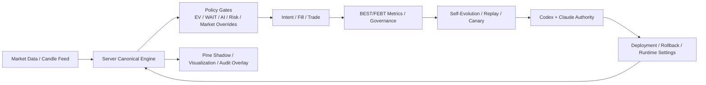

# BEST_SERVER_CANONICAL_ENGINE_MIGRATION_PLAN

- 제정: 2026-03-31
- 상태: ACTIVE
- 목적:
  - `TradingView Pine`가 현재 들고 있는 정본 신호 생성 책임을 `서버 canonical engine`으로 점진 이전하기 위한 상위 실행 계획을 정의한다.
  - `완전 자동 자율 진화`를 막는 마지막 구조적 수동 경계인 `Pine manual paste`를 제거하는 로드맵을 만든다.
  - `Pine -> webhook -> runtime -> BEST/FEBT -> self-evolution -> authority -> deployment -> rollback` 전체를 서버 정본 기준으로 재정렬한다.
- 연계 문서:
  - `/Users/jeongjaeyong/Projects/donbeolja/docs/BEST_PINE_TO_SELF_EVOLUTION_SYSTEM_MAP.md`
  - `/Users/jeongjaeyong/Projects/donbeolja/docs/BEST_SELF_EVOLUTION_MASTER_SPEC.md`
  - `/Users/jeongjaeyong/Projects/donbeolja/docs/PINE_AND_FILTER_STAGE_ROLES.md`
  - `/Users/jeongjaeyong/Projects/donbeolja/docs/BEST_SELF_EVOLUTION_DEPLOYMENT_AUTOPILOT_SPEC.md`
  - `/Users/jeongjaeyong/Projects/donbeolja/docs/BEST_FEBT_SYSTEM_ROLLOUT_PLAN.md`
  - `/Users/jeongjaeyong/Projects/donbeolja/docs/BEST_OPERATIONAL_GUARDS.md`

## 1. 한 줄 정의

최종 목표는 `Pine가 alert source`인 구조를 `서버가 canonical signal engine`인 구조로 바꾸고, Pine는 `시각화 + shadow + 보조 telemetry emitter`로 낮추는 것이다.

## 2. 왜 이 전환이 필요한가

현재 시스템의 마지막 구조적 자동화 한계는 아래 4개다.

1. `Pine manual paste`
   - 새 Pine 버전은 TradingView 편집기에 수동 붙여넣기가 필요하다.
2. `live signal confirmation dependence`
   - 붙여넣기 후 첫 `LONG/SHORT` 신호가 올 때까지 `APPLIED_PENDING_SIGNAL_CONFIRMATION` 상태가 남는다.
3. `rollback manual boundary`
   - rollback file이 준비돼도 Pine 자체를 되돌리지 않으면 signal source는 바뀌지 않는다.
4. `PINE scope candidate dependence`
   - threshold나 regime gating이 Pine 내부에 있으면 self-evolution이 직접 적용할 수 없다.

위 4개는 모두 `signal source of truth`가 Pine에 있기 때문에 생긴다.

## 3. 최종 목표 상태

### 3.1 Target Architecture

### 3.2 역할 재정의

1. `서버 canonical engine`
   - 최종 `LONG/SHORT` 신호와 timing band를 계산한다.
   - `strategy_id`, `candidate_origin`, `policy_version`, `threshold_bundle_version`을 직접 부여한다.
2. `Pine`
   - 차트 표시
   - shadow telemetry
   - 서버 판단과의 parity audit
   - 필요 시 운영자 수동 검토용 overlay
3. `self-evolution`
   - 더 이상 `Pine file handoff`를 최종 승격 단위로 보지 않는다.
   - `server engine bundle + policy bundle`을 최종 승격 단위로 본다.

## 4. 설계 원칙

1. `No Big Bang`
   - 한 번에 Pine를 죽이지 않는다.
   - `shadow -> parity -> server-primary -> pine-demotion` 단계로 간다.
2. `Signal Meaning Must Stay Stable`
   - `LONG/SHORT`, `EARLY/CORE`, `FEBT_*`의 의미가 migration 중 바뀌면 안 된다.
3. `Pine Logic and Threshold Must Split`
   - raw metric 계산은 Pine/서버 양쪽에 둘 수 있어도, threshold는 가능한 한 서버로 모은다.
4. `Rollback Must Stay First-Class`
   - canonical engine 전환 이후 rollback은 `runtime settings`와 `engine bundle` 전환만으로 끝나야 한다.
5. `Parity Before Promotion`
   - Pine와 server canonical output이 합의된 뒤에만 server-primary로 승격한다.

## 5. 현재 상태와 목표 상태의 차이

| 항목 | 현재 | 목표 |
| --- | --- | --- |
| 신호 정본 | Pine | Server canonical engine |
| threshold 주인 | Pine + 서버 혼합 | 서버 단일 |
| Pine 붙여넣기 | 필요 | 불필요 |
| rollback | Pine 수동 경계 존재 | 서버 runtime rollback |
| live confirm | webhook 첫 실신호 의존 | server deployment probe / engine health check |
| self-evolution deploy unit | Pine file + settings 혼합 | engine bundle + policy bundle |
| authority 판정 단위 | Pine promotion 중심 | engine/policy promotion 중심 |

## 6. 마이그레이션 범위

### 6.1 서버로 내려야 하는 것

1. `entry_core_score_abs`
2. `shared_regime_transition_confirmation`
3. `EARLY/CORE threshold`
4. `market-specific tighten/relax`
5. `FEBT timing threshold`
6. `strategy rollout allowlist`
7. `promotion / rollback switch`

### 6.2 Pine에 남겨도 되는 것

1. 시각화
2. 운영자 설명용 label/overlay
3. raw score/metric 계산 shadow
4. 서버 판정 대비 drift audit

### 6.3 Pine에만 남기면 안 되는 것

1. live entry 발화의 최종 승인권
2. rollout blocking threshold
3. recovery promotion 핵심 gating
4. rollback의 실질적 적용권

## 7. 실행 단계

## 7.1 Phase A - 계약 고정

목표:
- Pine와 server가 공통으로 쓰는 `signal contract`를 먼저 고정한다.

필수 산출물:
1. `canonical signal schema`
2. `threshold bundle schema`
3. `policy bundle schema`
4. `parity audit schema`

필수 작업:
1. candidate를 3종으로 재분류
   - `SERVER_POLICY`
   - `PINE_THRESHOLD`
   - `PINE_LOGIC`
2. 현재 `PINE_THRESHOLD` 항목을 전수 목록화
3. `LONG/SHORT`, `EARLY/CORE`, `FEBT_*` 필드 의미를 코드/문서 모두에서 고정

완료 기준:
1. 후보 변경이 항상 위 3분류 중 하나로 기록된다.
2. threshold 변경은 더 이상 “Pine 변경”으로 뭉뚱그려지지 않는다.

## 7.2 Phase B - Threshold Serverization

목표:
- `PINE_THRESHOLD` 항목을 서버 settings로 이동한다.

핵심 아이디어:
1. Pine는 raw metric을 보낸다.
2. 서버가 threshold를 읽어 최종 판정한다.

예시:
1. Pine:
   - `core_score = 27`
   - `regime_transition_score = 2`
   - `wave = 0.57`
2. 서버:
   - `entry_core_score_abs >= 29`
   - `transition_confirmation >= 2`
   - `wave_floor >= 0.54`

필수 작업:
1. `features_json`에 raw metric bundle 확장
2. runtime settings에 threshold bundle 추가
3. self-evolution candidate가 threshold bundle만 바꾸는 경로 구현
4. stage autopilot이 threshold bundle 배포를 직접 수행

완료 기준:
1. `AUTO_MARKET_AXSUSDT_REGIME_TIGHTEN` 류 candidate를 Pine paste 없이 적용 가능
2. `PINE_THRESHOLD` class candidate의 80% 이상이 server-only 배포 가능

## 7.3 Phase C - Server Shadow Canonical Engine

목표:
- 아직 live execution은 Pine alert를 쓰되, 서버가 같은 candle에 대해 독립적으로 canonical decision을 계산한다.

필수 작업:
1. `src/services/canonicalEngine/` 신설
2. 구성 모듈 분리
   - `featureSnapshot`
   - `signalClassifier`
   - `timingBandResolver`
   - `febtTimingResolver`
   - `thresholdResolver`
   - `canonicalDecision`
3. Pine output과 server output의 parity 저장
4. drift artifact 추가

핵심 산출물:
1. `canonical_engine_parity_latest.json`
2. 시장별 drift rate
3. signal timing delta
4. false-negative / false-positive matrix

완료 기준:
1. 14일 이상 shadow parity 측정 가능
2. primary market에서 `LONG/SHORT` parity >= 95%
3. `EARLY/CORE` parity >= 90%

## 7.4 Phase D - Server-Primary Canary

목표:
- 일부 승인 시장에서 서버 canonical output을 실제 signal source로 승격한다.

필수 작업:
1. market allowlist 기반 server-primary 모드
2. Pine-primary / server-primary 비교 canary
3. rollback switch를 runtime settings로 제공
4. `authority`가 engine bundle promotion을 심사하게 변경

안전 장치:
1. `server-primary`는 승인 시장군에만 적용
2. parity drift 초과 시 즉시 `pine-shadow-only` 또는 이전 engine bundle로 rollback

완료 기준:
1. 승인 시장군에서 server-primary live 실행
2. Pine는 shadow overlay로만 동작
3. rollback이 Pine paste 없이 완료

## 7.5 Phase E - Live Confirm 경계 제거

목표:
- 더 이상 `첫 Pine 실신호`를 confirmation 근거로 쓰지 않는다.

필수 작업:
1. deployment confirm 단위를 `server engine bundle active`로 변경
2. `live_signal_confirmed` 대신
   - `engine_bundle_loaded`
   - `policy_bundle_loaded`
   - `market_data_flow_ok`
   - `first_decision_seen`
   를 분리 기록
3. timeout 기반 confirm 또는 probe 기반 confirm 도입

완료 기준:
1. `APPLIED_PENDING_SIGNAL_CONFIRMATION` 상태가 Pine signal 대기 때문에 무기한 지속되지 않음
2. deployment plan은 `engine active`만으로 confirm 가능

## 7.6 Phase F - Pine Demotion

목표:
- Pine를 더 이상 운영 정본으로 보지 않는다.

Pine의 남는 역할:
1. chart overlay
2. shadow telemetry
3. drift audit
4. 운영자 설명용 시각화

서버의 남는 역할:
1. signal source of truth
2. threshold owner
3. execution source of truth
4. rollback source of truth

완료 기준:
1. `manual paste ack` 제거 또는 optional-only로 전환
2. self-evolution deployment plan이 Pine file path 없이도 완결
3. `authority bypass`가 Pine 붙여넣기 때문에 생기지 않음

## 8. 권위 체계 변경 계획

현재:
1. Pine promotion 중심 authority
2. disagreement 시 `HOLD`
3. live confirm 대기 중 authority 교착 가능

목표:
1. `engine bundle`과 `policy bundle`에 대해 authority 심사
2. tiebreaker 추가
3. `pending signal confirmation` 대신 `bundle activation proof` 사용

필수 작업:
1. `selfEvolutionAuthorityEnsemble`에 tiebreaker policy 추가
2. confidence/severity/time-based degrade 규칙 추가
3. `rollback_only` 안전 모드 정의

## 9. FEBT와의 관계

canonical engine 전환은 FEBT rollout과 충돌하지 않는다. 오히려 FEBT를 더 쉽게 만든다.

이유:
1. 현재 FEBT payload missing 문제는 Pine emit 범위에 묶여 있다.
2. server canonical engine이 timing/febt를 직접 계산하면 Phase 0 baseline이 Pine emit 누락에 덜 의존한다.
3. Phase 4/5 readiness도 server-side metric 기준으로 더 안정적으로 측정 가능하다.

단, 초기 단계에서는 Pine와 server가 같은 `FEBT field contract`를 써야 한다.

## 10. 파일 단위 구현 계획

### 10.1 신규 영역

1. `/Users/jeongjaeyong/Projects/donbeolja/src/services/canonicalEngine/featureSnapshot.js`
2. `/Users/jeongjaeyong/Projects/donbeolja/src/services/canonicalEngine/signalClassifier.js`
3. `/Users/jeongjaeyong/Projects/donbeolja/src/services/canonicalEngine/timingBandResolver.js`
4. `/Users/jeongjaeyong/Projects/donbeolja/src/services/canonicalEngine/febtTimingResolver.js`
5. `/Users/jeongjaeyong/Projects/donbeolja/src/services/canonicalEngine/thresholdResolver.js`
6. `/Users/jeongjaeyong/Projects/donbeolja/src/services/canonicalEngine/canonicalDecision.js`

### 10.2 기존 수정 영역

1. `/Users/jeongjaeyong/Projects/donbeolja/src/routes/webhook.routes.js`
   - Pine-origin webhook와 server-origin canonical decision을 함께 수용
2. `/Users/jeongjaeyong/Projects/donbeolja/src/engine/paperUpbitRunner.js`
   - entry source를 `PINE_PRIMARY | SERVER_SHADOW | SERVER_PRIMARY`로 분기
3. `/Users/jeongjaeyong/Projects/donbeolja/scripts/automation-self-evolution-loop.js`
   - candidate 분류에 `SERVER_POLICY / PINE_THRESHOLD / PINE_LOGIC / ENGINE_LOGIC` 추가
4. `/Users/jeongjaeyong/Projects/donbeolja/scripts/automation-stage-autopilot.js`
   - Pine file handoff 대신 engine bundle handoff 지원
5. `/Users/jeongjaeyong/Projects/donbeolja/src/utils/bestSelfEvolutionDeploymentPlan.js`
   - `prepared_engine_bundle_id`, `applied_engine_bundle_id` 추적
6. `/Users/jeongjaeyong/Projects/donbeolja/src/utils/selfEvolutionRuntimeState.js`
   - Pine confirm 중심 상태에서 bundle activation 중심 상태로 이동

## 11. 단계별 성공 기준

### Stage 1 Success
1. threshold candidate 대부분이 server-only 적용 가능
2. Pine paste 빈도 주 1회 이하

### Stage 2 Success
1. server shadow parity artifact가 안정적으로 생성
2. parity drift가 승인 기준 이하

### Stage 3 Success
1. 최소 2개 승인 시장에서 server-primary canary PASS
2. rollback이 Pine paste 없이 5분 내 수행

### Stage 4 Success
1. deployment plan이 Pine file path 없이 완결
2. authority가 engine bundle 기준으로 promote/rollback
3. `AUTONOMY_EXCEPT_PINE`이 아니라 실질 `FULL_AUTONOMY`로 바뀜

## 12. 비목표

이번 계획은 아래를 당장 하자는 뜻이 아니다.

1. TradingView를 즉시 제거
2. Pine 시각화를 즉시 폐기
3. 모든 indicator logic를 한 번에 서버로 이식
4. FEBT Phase 4/5 readiness를 이 문서 하나로 대체

## 13. 우선순위

1. `PINE_THRESHOLD -> SERVER_POLICY` 전환
2. `authority tiebreaker + bundle activation proof`
3. `server shadow canonical engine`
4. `server-primary canary + rollback`
5. `Pine demotion`

## 14. 한 줄 결론

완전 자동 자율 진화로 가려면 `Pine를 더 잘 자동화`하는 것만으로는 부족하다. 최종적으로는 `서버가 신호 정본이 되고 Pine는 shadow/visualization으로 내려가는 구조`가 필요하다.
