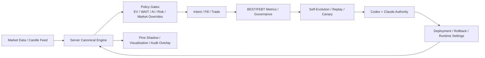

# BEST_SERVER_CANONICAL_ENGINE_MIGRATION_PLAN

- 제정: 2026-03-31
- 상태: ACTIVE
- 목적:
  - `TradingView Pine`가 현재 들고 있는 정본 신호 생성 책임을 `서버 canonical engine`으로 점진 이전하기 위한 상위 실행 계획을 정의한다.
  - `완전 자동 자율 진화`를 막는 마지막 구조적 수동 경계인 `Pine manual paste`를 제거하는 로드맵을 만든다.
  - `Pine -> webhook -> runtime -> BEST/FEBT -> self-evolution -> authority -> deployment -> rollback` 전체를 서버 정본 기준으로 재정렬한다.
- 연계 문서:
  - `/Users/jeongjaeyong/Projects/donbeolja/docs/BEST_PINE_TO_SELF_EVOLUTION_SYSTEM_MAP.md`
  - `/Users/jeongjaeyong/Projects/donbeolja/docs/BEST_SELF_EVOLUTION_MASTER_SPEC.md`
  - `/Users/jeongjaeyong/Projects/donbeolja/docs/PINE_AND_FILTER_STAGE_ROLES.md`
  - `/Users/jeongjaeyong/Projects/donbeolja/docs/BEST_SELF_EVOLUTION_DEPLOYMENT_AUTOPILOT_SPEC.md`
  - `/Users/jeongjaeyong/Projects/donbeolja/docs/BEST_FEBT_SYSTEM_ROLLOUT_PLAN.md`
  - `/Users/jeongjaeyong/Projects/donbeolja/docs/BEST_OPERATIONAL_GUARDS.md`

## 0. 최신 구현 상태

2026-03-31 21:34 KST 기준 최신 cycle `best_self_evolution_2026-03-31_2128_1dc17b7c`의 상태는 아래와 같다.

1. `Phase A`
   - `PASS`
2. `Phase B`
   - `PASS`
3. `Phase C`
   - `PASS`
   - post-cutover canonical provenance가 `8/8`로 닫혔다.
   - post-cutover `execution_source`, `pine_overlay_role`, `actual_source_decision`까지 모두 `8/8`로 남는다.
4. `Phase D`
   - `PARTIAL`
   - `AXSUSDT`는 이미 `SERVER_PRIMARY`다.
   - acceptance watch 기준 `observed_n = 1`, `executed_n = 0`, `phase_d_reason = SERVER_PRIMARY_ACCEPTANCE_SAMPLE_SHORT`라 아직 닫히지 않았다.
5. `Phase E`
   - `PASS`
   - deployment probe와 bundle activation은 `ACTIVE_BY_PROBE`로 닫힌다.
6. `Phase F`
   - `PASS`
   - deploy unit은 `ENGINE_POLICY_BUNDLE` 기준이고, 최신 SSOT는 `*_PENDING_AUTHORITY`만 쓴다.
7. `운영 substrate`
   - `PASS`
   - local automation scheduler는 이제 `OpenClaw cron`이 정본이다.
   - Telegram alert transport도 `OpenClaw-first`로 바뀌었고, watchdog는 `OPENCLAW_CRON`을 scheduler SSOT로 읽는다.
8. `OpenClaw autonomy governor`
   - `ACTIVE`
   - autonomy contract는 `OBJECTIVE_RECOVERY_REQUIRED`를 선언하고, bounded degraded authority policy를 들고 있다.
   - objective recovery governor는 현재 `RECOVERY_REPLAY_BLOCKED`다.
   - degraded authority eligibility도 아직 `false`이며, authority ensemble은 `timeout consensus`가 아니어서 degraded policy를 실제로 쓰지 않았다.

남은 구조적 작업은 없다. 남은 것은 `Phase D 운영 acceptance sample`, `external authority pending`, `timeout degraded-policy 실발동 검증` 같은 운영 상태다.

## 1. 한 줄 정의

최종 목표는 `Pine가 alert source`인 구조를 `서버가 canonical signal engine`인 구조로 바꾸고, Pine는 `시각화 + shadow + 보조 telemetry emitter`로 낮추는 것이다.

## 2. 왜 이 전환이 필요했고 아직 완전히 끝나지 않았는가

이 전환을 시작하게 만든 원래 구조적 한계는 아래 4개다. 일부는 이미 해소됐고, 일부는 운영 acceptance만 남아 있다.

1. `Pine manual paste`
   - 새 Pine 버전은 TradingView 편집기에 수동 붙여넣기가 필요하다.
2. `live signal confirmation dependence`
   - 붙여넣기 후 bundle activation proof가 닫힐 때까지 `APPLIED_PENDING_BUNDLE_ACTIVATION` 상태가 남는다.
3. `rollback manual boundary`
   - rollback file이 준비돼도 Pine 자체를 되돌리지 않으면 signal source는 바뀌지 않는다.
4. `PINE scope candidate dependence`
   - threshold나 regime gating이 Pine 내부에 있으면 self-evolution이 직접 적용할 수 없다.

현재 이 4개는 구조적으로는 대부분 해소됐다. 남은 것은 `OpenClaw autonomy contract` 아래에서 운영 증거를 충분히 쌓아 완전 자율 상태로 닫는 일이다.

위 4개는 모두 `signal source of truth`가 Pine에 있기 때문에 생긴다.

## 3. 최종 목표 상태

### 3.1 Target Architecture

### 3.2 역할 재정의

1. `서버 canonical engine`
   - 최종 `LONG/SHORT` 신호와 timing band를 계산한다.
   - `strategy_id`, `candidate_origin`, `policy_version`, `threshold_bundle_version`을 직접 부여한다.
2. `Pine`
   - 차트 표시
   - shadow telemetry
   - 서버 판단과의 parity audit
   - 필요 시 운영자 수동 검토용 overlay
3. `self-evolution`
   - 더 이상 `Pine file handoff`를 최종 승격 단위로 보지 않는다.
   - `server engine bundle + policy bundle`을 최종 승격 단위로 본다.

## 4. 설계 원칙

1. `No Big Bang`
   - 한 번에 Pine를 죽이지 않는다.
   - `shadow -> parity -> server-primary -> pine-demotion` 단계로 간다.
2. `Signal Meaning Must Stay Stable`
   - `LONG/SHORT`, `EARLY/CORE`, `FEBT_*`의 의미가 migration 중 바뀌면 안 된다.
3. `Pine Logic and Threshold Must Split`
   - raw metric 계산은 Pine/서버 양쪽에 둘 수 있어도, threshold는 가능한 한 서버로 모은다.
4. `Rollback Must Stay First-Class`
   - canonical engine 전환 이후 rollback은 `runtime settings`와 `engine bundle` 전환만으로 끝나야 한다.
5. `Parity Before Promotion`
   - Pine와 server canonical output이 합의된 뒤에만 server-primary로 승격한다.

## 5. 현재 상태와 목표 상태의 차이

| 항목 | 현재 | 목표 |
| --- | --- | --- |
| 신호 정본 | hybrid (`PINE_PRIMARY` 다수 + 선택 시장 `SERVER_PRIMARY`) | Server canonical engine |
| threshold 주인 | Pine + 서버 혼합 | 서버 단일 |
| Pine 붙여넣기 | legacy overlay 경계로만 남아 있음 | optional-only 또는 제거 |
| rollback | runtime rollback 가능, overlay 경계만 legacy로 잔존 | 서버 runtime rollback |
| live confirm | deployment probe / bundle activation | server deployment probe / engine health check |
| self-evolution deploy unit | engine bundle + policy bundle | engine bundle + policy bundle |
| authority 판정 단위 | engine/policy bundle 중심 | engine/policy promotion 중심 |

## 6. 마이그레이션 범위

### 6.1 서버로 내려야 하는 것

1. `entry_core_score_abs`
2. `shared_regime_transition_confirmation`
3. `EARLY/CORE threshold`
4. `market-specific tighten/relax`
5. `FEBT timing threshold`
6. `strategy rollout allowlist`
7. `promotion / rollback switch`

### 6.2 Pine에 남겨도 되는 것

1. 시각화
2. 운영자 설명용 label/overlay
3. raw score/metric 계산 shadow
4. 서버 판정 대비 drift audit

### 6.3 Pine에만 남기면 안 되는 것

1. live entry 발화의 최종 승인권
2. rollout blocking threshold
3. recovery promotion 핵심 gating
4. rollback의 실질적 적용권

## 7. 실행 단계

## 7.1 Phase A - 계약 고정

목표:
- Pine와 server가 공통으로 쓰는 `signal contract`를 먼저 고정한다.

필수 산출물:
1. `canonical signal schema`
2. `threshold bundle schema`
3. `policy bundle schema`
4. `parity audit schema`

필수 작업:
1. candidate를 3종으로 재분류
   - `SERVER_POLICY`
   - `PINE_THRESHOLD`
   - `PINE_LOGIC`
2. 현재 `PINE_THRESHOLD` 항목을 전수 목록화
3. `LONG/SHORT`, `EARLY/CORE`, `FEBT_*` 필드 의미를 코드/문서 모두에서 고정

완료 기준:
1. 후보 변경이 항상 위 3분류 중 하나로 기록된다.
2. threshold 변경은 더 이상 “Pine 변경”으로 뭉뚱그려지지 않는다.

## 7.2 Phase B - Threshold Serverization

목표:
- `PINE_THRESHOLD` 항목을 서버 settings로 이동한다.

핵심 아이디어:
1. Pine는 raw metric을 보낸다.
2. 서버가 threshold를 읽어 최종 판정한다.

예시:
1. Pine:
   - `core_score = 27`
   - `regime_transition_score = 2`
   - `wave = 0.57`
2. 서버:
   - `entry_core_score_abs >= 29`
   - `transition_confirmation >= 2`
   - `wave_floor >= 0.54`

필수 작업:
1. `features_json`에 raw metric bundle 확장
2. runtime settings에 threshold bundle 추가
3. self-evolution candidate가 threshold bundle만 바꾸는 경로 구현
4. stage autopilot이 threshold bundle 배포를 직접 수행

완료 기준:
1. `AUTO_MARKET_AXSUSDT_REGIME_TIGHTEN` 류 candidate를 Pine paste 없이 적용 가능
2. `PINE_THRESHOLD` class candidate의 80% 이상이 server-only 배포 가능

## 7.3 Phase C - Server Shadow Canonical Engine

목표:
- 아직 live execution은 Pine alert를 쓰되, 서버가 같은 candle에 대해 독립적으로 canonical decision을 계산한다.

필수 작업:
1. `src/services/canonicalEngine/` 신설
2. 구성 모듈 분리
   - `featureSnapshot`
   - `signalClassifier`
   - `timingBandResolver`
   - `febtTimingResolver`
   - `thresholdResolver`
   - `canonicalDecision`
3. Pine output과 server output의 parity 저장
4. drift artifact 추가

핵심 산출물:
1. `canonical_engine_parity_latest.json`
2. 시장별 drift rate
3. signal timing delta
4. false-negative / false-positive matrix

완료 기준:
1. 14일 이상 shadow parity 측정 가능
2. primary market에서 `LONG/SHORT` parity >= 95%
3. `EARLY/CORE` parity >= 90%

## 7.4 Phase D - Server-Primary Canary

목표:
- 일부 승인 시장에서 서버 canonical output을 실제 signal source로 승격한다.

필수 작업:
1. market allowlist 기반 server-primary 모드
2. Pine-primary / server-primary 비교 canary
3. rollback switch를 runtime settings로 제공
4. `authority`가 engine bundle promotion을 심사하게 변경
5. `OpenClaw autonomy contract`가 degraded timeout policy와 acceptance policy를 같이 소유

안전 장치:
1. `server-primary`는 승인 시장군에만 적용
2. parity drift 초과 시 즉시 `pine-shadow-only` 또는 이전 engine bundle로 rollback

완료 기준:
1. 승인 시장군에서 server-primary live 실행
2. Pine는 shadow overlay로만 동작
3. rollback이 Pine paste 없이 완료
4. acceptance watch가 `executed_n >= 2`와 disagreement/rollback guard를 모두 통과

## 7.5 Phase E - Live Confirm 경계 제거

목표:
- 더 이상 `첫 Pine 실신호`를 confirmation 근거로 쓰지 않는다.

필수 작업:
1. deployment confirm 단위를 `server engine bundle active`로 변경
2. `live_signal_confirmed` 대신
   - `engine_bundle_loaded`
   - `policy_bundle_loaded`
   - `market_data_flow_ok`
   - `first_decision_seen`
   를 분리 기록
3. timeout 기반 confirm 또는 probe 기반 confirm 도입

완료 기준:
1. `APPLIED_PENDING_BUNDLE_ACTIVATION` 상태가 Pine signal 대기 때문에 무기한 지속되지 않음
2. deployment plan은 `engine active`만으로 confirm 가능

## 7.6 Phase F - Pine Demotion

목표:
- Pine를 더 이상 운영 정본으로 보지 않는다.

Pine의 남는 역할:
1. chart overlay
2. shadow telemetry
3. drift audit
4. 운영자 설명용 시각화

서버의 남는 역할:
1. signal source of truth
2. threshold owner
3. execution source of truth
4. rollback source of truth

완료 기준:
1. `manual paste ack` 제거 또는 optional-only로 전환
2. self-evolution deployment plan이 Pine file path 없이도 완결
3. `authority bypass`가 Pine 붙여넣기 때문에 생기지 않음

## 8. 현재 진행 상태

2026-03-31 기준 현재 상태는 아래와 같다.

1. `Phase A`
   - 완료
   - candidate에 `SERVER_POLICY / PINE_THRESHOLD / PINE_LOGIC` 분류가 들어갔다.
2. `Phase B`
   - 코드/산출물 기준 완료
   - canonical threshold settings 경로와 `CANONICAL_POLICY` stage가 추가됐다.
   - `AUTO_MARKET_AXSUSDT_REGIME_TIGHTEN` 류 candidate를 `SERVER_SETTINGS` deploy unit으로 변환할 수 있다.
   - canonical threshold bundle/version provenance 저장 경로와 검증 artifact가 추가됐다.
3. `Phase C`
   - 완료
   - `src/services/canonicalEngine/` 골격, parity report, loop parity step이 들어갔다.
   - parity는 stored source decision이 있으면 그것을 우선 쓰고, 없을 때만 derived source evidence를 fallback으로 사용한다.
   - 시장/티어/regime parity breakdown과 loop monitor 감시가 연결됐다.
   - post-cutover canonical provenance는 backfill과 저장 경로 수정 후 `8/8 PASS`로 닫혔다.
4. `Phase D`
   - 부분 완료
   - server-primary canary, `SOURCE_MODE` stage, authority `ENGINE_POLICY_BUNDLE` review unit이 들어갔다.
   - `AXSUSDT`는 실제 `SERVER_PRIMARY`로 올라갔고 canary row도 관측된다.
   - 단, 운영 acceptance는 `server_primary_executed_n >= 2`가 아직 아니어서 `SERVER_PRIMARY_ACCEPTANCE_SAMPLE_SHORT` 상태다.
5. `Phase E`
   - 완료
   - `bundle activation proof`가 `engine_bundle_loaded / policy_bundle_loaded / market_data_flow_ok / first_decision_seen` 기준으로 동작한다.
   - `ACTIVE_BY_TIMEOUT`은 제거됐고, `ACTIVE_BY_PROBE` 또는 실제 decision 근거로만 active가 닫힌다.
6. `Phase F`
   - 완료
   - deploy unit이 `engine_bundle / policy_bundle`로 재정의됐다.
   - Pine는 `shadow_pine` overlay/audit 계층으로 내려갔다.
   - 최신 artifact에는 `*_AUTHORITY_BYPASS` 상태가 더 이상 나타나지 않는다.
7. `운영 substrate`
   - 완료
   - `OpenClaw cron`이 16개 local automation을 모두 소유한다.
   - 기존 `launchd` label은 의도적으로 disabled 상태이고, watchdog는 이를 failure가 아니라 legacy diagnostic으로만 기록한다.
   - Telegram/summary alert는 repo alert path 기준 `OpenClaw-first`로 전송된다.

## 9. D~F 실행 계획

이 절은 현재 구현 상태를 기준으로 `바로 실행 가능한 순서`로 정리한다.

### 9.1 Phase D - Server-Primary Canary 상세 계획

목표:
- 승인 시장군에서 `PINE_PRIMARY`가 아니라 `SERVER_PRIMARY`를 실제 signal source로 쓰기 시작한다.

현재 선행조건:
1. canonical engine shadow 경로 존재
2. parity artifact 존재
3. `CANONICAL_POLICY` stage 존재
4. server-side threshold bundle 존재

남은 작업 패키지:

#### D-1. Source Mode 런타임 스위치 정식화

작업:
1. `canonical_engine_source_mode`를 시장 단위로 확장
   - 현재: 전역 모드 중심
   - 목표: `ALL | MARKET_OVERRIDES`
2. `canonical_engine_market_overrides`에 아래 필드 허용
   - `source_mode`
   - `core_score_abs`
   - `transition_core_score_abs`
   - 필요 시 `enabled`, `shadow_enabled`
3. `paperUpbitRunner.js`에서 시장별 `SERVER_PRIMARY` 분기 추가

산출물:
1. market-scoped source mode settings schema
2. runtime effective source mode snapshot

완료 기준:
1. AXSUSDT 같은 단일 시장만 `SERVER_PRIMARY`로 올릴 수 있다.
2. 다른 시장은 계속 `PINE_PRIMARY`로 유지된다.

#### D-2. Server-Primary Decision Audit 저장

작업:
1. signals / dropped / intents에 아래 필드 추가
   - `canonical_engine_source_mode_effective`
   - `canonical_engine_decision_id`
   - `canonical_engine_bundle_version`
   - `canonical_engine_threshold_bundle_version`
   - `canonical_engine_policy_origin`
2. source가 `SERVER_PRIMARY`일 때도 Pine shadow 비교를 별도 필드로 유지
   - `pine_shadow_decision`
   - `pine_shadow_parity_match`
3. fill/trade까지 engine provenance 전파

산출물:
1. end-to-end provenance chain

완료 기준:
1. 한 체결 row만 보고도 `누가 source였는지`와 `다른 쪽이 shadow에서 뭐라고 했는지`를 알 수 있다.

#### D-3. Server-Primary Canary Artifact 추가

작업:
1. 기존 `best_self_evolution_canary_latest.json`에 source mode breakdown 추가
2. 별도 artifact 추가
   - `best_self_evolution_server_primary_canary_latest.json`
3. 지표:
   - server-primary executed_n
   - pine-shadow disagreement_rate
   - server-primary win_rate
   - server-primary avg_ret_net
   - rollback trigger count

산출물:
1. server-primary 전용 canary report

완료 기준:
1. 승인 시장군의 server-primary 성과를 Pine-primary와 분리해서 볼 수 있다.

#### D-4. Server Rollback Switch

작업:
1. `rollback_to_source_mode = PINE_PRIMARY` 또는 이전 engine bundle을 runtime으로 즉시 적용
2. `deployment guards`와 `stage_autopilot`가 rollback을 Pine file이 아니라 settings/bundle switch로 수행
3. rollback 이후 parity/canary reset 규칙 정의

산출물:
1. source-mode rollback runbook
2. automatic rollback switch logic

완료 기준:
1. 승인 시장군 rollback이 Pine paste 없이 끝난다.

#### D-5. Authority 심사 단위 전환

작업:
1. Codex/Claude review 입력에 Pine file path 대신 아래를 추가
   - `canonical_engine_bundle_version`
   - `threshold_bundle_diff`
   - `source_mode_change`
2. authority verdict reason에 `SERVER_PRIMARY_PROMOTION_READY` 계열 reason 추가
3. `ROLLBACK/HOLD/PROMOTE`가 engine bundle 단위로 내려오게 수정

완료 기준:
1. authority가 더 이상 Pine 파일 승격 여부를 핵심 기준으로 보지 않는다.

Phase D 종료 조건:
1. 최소 1개 승인 시장에서 `SERVER_PRIMARY` live 실행
2. Pine는 같은 시장에서 shadow overlay만 수행
3. rollback이 runtime switch로 완료

### 9.2 Phase E - Live Confirm 경계 제거 상세 계획

목표:
- `첫 Pine 실신호`를 기다리는 confirmation 구조를 제거한다.

남은 작업 패키지:

#### E-1. Confirm Contract 분해

작업:
1. runtime state에 아래 필드 추가
   - `engine_bundle_loaded`
   - `policy_bundle_loaded`
   - `market_data_flow_ok`
   - `first_decision_seen`
   - `first_decision_source_mode`
2. 기존
   - `live_signal_confirmed`
   - `live_signal_confirmation_pending`
   를 deprecated 상태로 전환

완료 기준:
1. confirm 상태를 “신호 유무” 하나로 뭉뚱그리지 않는다.

#### E-2. Probe 기반 Confirm

작업:
1. market data health probe 추가
   - 최근 candle 수신
   - feature snapshot 생성 가능
   - canonical decision 계산 가능
2. deploy 직후 probe를 한 번 강제 실행
3. 첫 실제 signal이 없어도 `engine active`를 증명할 수 있게 함

산출물:
1. `best_self_evolution_deployment_probe_latest.json`

완료 기준:
1. 시장이 조용해도 deploy confirm이 가능하다.

#### E-3. Timeout Confirm

작업:
1. deployment plan에
   - `confirmation_timeout_minutes`
   - `confirmation_deadline_kst`
   추가
2. deadline 내 `first_decision_seen` 또는 `probe_pass`면 confirm
3. deadline 초과 시
   - `DEPLOYMENT_CONFIRM_TIMEOUT`
   - 또는 자동 rollback

완료 기준:
1. `APPLIED_PENDING_BUNDLE_ACTIVATION`가 무기한 지속되지 않는다.

#### E-4. Manual Paste Ack 축소

작업:
1. `ack-self-evolution-manual-paste.js`를 server-primary 시대에 맞게 축소
2. manual ack는 `operator_observed_visual_sync` 정도만 남기고,
   실제 deploy confirm은 runtime probe가 담당

완료 기준:
1. manual ack는 참고 정보이고, 정본 상태를 결정하지 않는다.

Phase E 종료 조건:
1. deployment plan이 Pine signal 대기 없이 `CONFIRMED` 또는 `TIMEOUT/ROLLBACK`으로 닫힘
2. runtime state가 confirm 근거를 구조적으로 남김

### 9.3 Phase F - Pine Demotion 상세 계획

목표:
- Pine를 정본 signal source에서 완전히 내리고, overlay/shadow/audit 역할만 남긴다.

남은 작업 패키지:

#### F-1. Deploy Unit 재정의

작업:
1. self-evolution deploy unit을 아래 두 개로 고정
   - `engine_bundle`
   - `policy_bundle`
2. `prepared_file_path`, `rollback_source_file_path` 중심 구조를
   - `prepared_engine_bundle`
   - `prepared_policy_bundle`
   - `rollback_engine_bundle`
   로 전환

완료 기준:
1. deployment plan이 Pine file path 없이 완결된다.

#### F-2. Pine를 Shadow/Overlay 전용으로 고정

작업:
1. Pine alert는 운영 source가 아니라 shadow audit 태그를 포함
2. Pine signal이 서버 정본과 다르면 drift row로만 기록
3. Pine 쪽 `strategy_id`는 운영 배포판이 아니라 overlay build id로 재정의 가능 여부 검토

완료 기준:
1. Pine drift가 운영 체결 source를 바꾸지 않는다.

#### F-3. External Authority Pending 정규화

작업:
1. `manual paste`가 없어지면 `AUTHORITY_BYPASS`라는 이름 자체를 제거
2. 최신 SSOT는 `APPLIED_*_PENDING_AUTHORITY`만 쓰고, `*_AUTHORITY_BYPASS`는 입력 호환만 유지
3. authority verdict 없이 live source가 바뀌는 경로 봉쇄

완료 기준:
1. 최신 artifact에 `*_AUTHORITY_BYPASS` 상태가 더 이상 나타나지 않는다.
2. 남은 의미는 `authority_state=PENDING` 하나로 수렴한다.

#### F-4. 문서/리포트/운영 용어 전환

작업:
1. 아래 문서 용어를 교체
   - `prepared pine`
   - `manual paste`
   - `strategy mismatch`
   를 engine/policy/deploy probe 기준 용어로 변경
2. objective/supervisor/stage/loop monitor에 Pine 관련 필드를 optional shadow 필드로 이동

완료 기준:
1. 운영 문서에서 Pine는 정본이 아니라 보조 계층으로만 등장한다.

Phase F 종료 조건:
1. 운영 source of truth가 server canonical engine으로 완전히 이전
2. Pine 붙여넣기 미실행이 운영 진화를 막지 않음
3. self-evolution, authority, rollback, confirm이 모두 engine/policy bundle 기준으로 닫힘

## 10. 현재 남은 운영 순서

남은 실작업은 구현보다 운영 증거 수집이다.

1. `Phase D acceptance sample 누적`
   - `AXSUSDT SERVER_PRIMARY`에서 `executed_n >= 2`를 먼저 만든다.
2. `server-primary 성과 검증`
   - disagreement / rollback trigger / avg_ret_net을 canary artifact로 확인한다.
3. `시장 확장 여부 결정`
   - acceptance가 닫히면 두 번째 승인 시장으로 `SERVER_PRIMARY`를 확장한다.
4. `운영 HOLD 해소`
   - external authority, objective, governance blocker를 bundle 기준으로 계속 본다.

## 11. 구현 메모

현재 구현된 추가 메모는 아래와 같다.

1. canonical provenance 결함은 아래 두 방식으로 닫혔다.
   - runner 저장 경로 수정
   - `/Users/jeongjaeyong/Projects/donbeolja/scripts/backfill-canonical-engine-provenance.js`
2. post-cutover provenance는 현재 `8/8 PASS`다.
3. server-primary canary는 현재 `AXSUSDT 1 row / executed 0` 상태다.

## 8. 권위 체계 변경 계획

현재:
1. Pine promotion 중심 authority
2. disagreement 시 `HOLD`
3. live confirm 대기 중 authority 교착 가능

목표:
1. `engine bundle`과 `policy bundle`에 대해 authority 심사
2. tiebreaker 추가
3. `pending signal confirmation` 대신 `bundle activation proof` 사용

필수 작업:
1. `selfEvolutionAuthorityEnsemble`에 tiebreaker policy 추가
2. confidence/severity/time-based degrade 규칙 추가
3. `rollback_only` 안전 모드 정의

## 9. FEBT와의 관계

canonical engine 전환은 FEBT rollout과 충돌하지 않는다. 오히려 FEBT를 더 쉽게 만든다.

이유:
1. 현재 FEBT payload missing 문제는 Pine emit 범위에 묶여 있다.
2. server canonical engine이 timing/febt를 직접 계산하면 Phase 0 baseline이 Pine emit 누락에 덜 의존한다.
3. Phase 4/5 readiness도 server-side metric 기준으로 더 안정적으로 측정 가능하다.

단, 초기 단계에서는 Pine와 server가 같은 `FEBT field contract`를 써야 한다.

## 10. 파일 단위 구현 계획

### 10.1 신규 영역

1. `/Users/jeongjaeyong/Projects/donbeolja/src/services/canonicalEngine/featureSnapshot.js`
2. `/Users/jeongjaeyong/Projects/donbeolja/src/services/canonicalEngine/signalClassifier.js`
3. `/Users/jeongjaeyong/Projects/donbeolja/src/services/canonicalEngine/timingBandResolver.js`
4. `/Users/jeongjaeyong/Projects/donbeolja/src/services/canonicalEngine/febtTimingResolver.js`
5. `/Users/jeongjaeyong/Projects/donbeolja/src/services/canonicalEngine/thresholdResolver.js`
6. `/Users/jeongjaeyong/Projects/donbeolja/src/services/canonicalEngine/canonicalDecision.js`

### 10.2 기존 수정 영역

1. `/Users/jeongjaeyong/Projects/donbeolja/src/routes/webhook.routes.js`
   - Pine-origin webhook와 server-origin canonical decision을 함께 수용
2. `/Users/jeongjaeyong/Projects/donbeolja/src/engine/paperUpbitRunner.js`
   - entry source를 `PINE_PRIMARY | SERVER_SHADOW | SERVER_PRIMARY`로 분기
3. `/Users/jeongjaeyong/Projects/donbeolja/scripts/automation-self-evolution-loop.js`
   - candidate 분류에 `SERVER_POLICY / PINE_THRESHOLD / PINE_LOGIC / ENGINE_LOGIC` 추가
4. `/Users/jeongjaeyong/Projects/donbeolja/scripts/automation-stage-autopilot.js`
   - Pine file handoff 대신 engine bundle handoff 지원
5. `/Users/jeongjaeyong/Projects/donbeolja/src/utils/bestSelfEvolutionDeploymentPlan.js`
   - `prepared_engine_bundle_id`, `applied_engine_bundle_id` 추적
6. `/Users/jeongjaeyong/Projects/donbeolja/src/utils/selfEvolutionRuntimeState.js`
   - Pine confirm 중심 상태에서 bundle activation 중심 상태로 이동

## 11. 단계별 성공 기준

### Stage 1 Success
1. threshold candidate 대부분이 server-only 적용 가능
2. Pine paste 빈도 주 1회 이하

### Stage 2 Success
1. server shadow parity artifact가 안정적으로 생성
2. parity drift가 승인 기준 이하

### Stage 3 Success
1. 최소 2개 승인 시장에서 server-primary canary PASS
2. rollback이 Pine paste 없이 5분 내 수행

### Stage 4 Success
1. deployment plan이 Pine file path 없이 완결
2. authority가 engine bundle 기준으로 promote/rollback
3. `AUTONOMY_EXCEPT_PINE`이 아니라 실질 `FULL_AUTONOMY`로 바뀜

## 12. 비목표

이번 계획은 아래를 당장 하자는 뜻이 아니다.

1. TradingView를 즉시 제거
2. Pine 시각화를 즉시 폐기
3. 모든 indicator logic를 한 번에 서버로 이식
4. FEBT Phase 4/5 readiness를 이 문서 하나로 대체

## 13. 현재 우선순위

1. `SERVER_PRIMARY acceptance sample 확보`
2. `server-primary canary + rollback 관찰`
3. `objective / governance / authority blocker 해소`
4. `승인 시장 확장`
5. `장기적으로 Pine manual paste optional-only 전환`

## 14. 한 줄 결론

완전 자동 자율 진화로 가려면 `Pine를 더 잘 자동화`하는 것만으로는 부족하다. 최종적으로는 `서버가 신호 정본이 되고 Pine는 shadow/visualization으로 내려가는 구조`가 필요하다.
