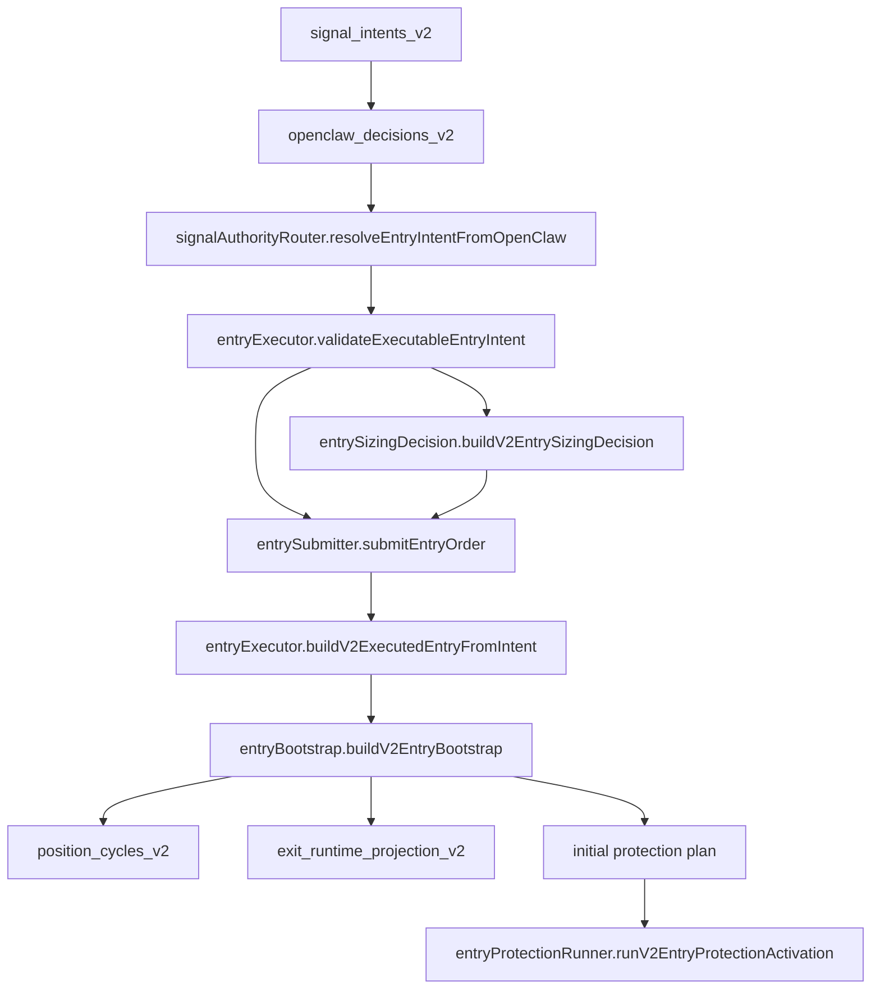

# DONBEOLJA V2 Entry Architecture

## 목적

이 문서는 V2 entry 경로의 single-writer 계약을 고정한다.

핵심은 "진입은 되었는데 lineage가 비거나 보호주문이 나중에 따로 맞춰지는" V1식 경로를 다시 만들지 않는 것이다.

V2 entry는 아래 네 가지를 동시에 만족해야 한다.

1. executable decision provenance가 완전하다
2. `position_cycle_id` 가 진입 시점에 고정된다
3. native protection 계획이 진입 bootstrap과 같은 계약에서 생성된다
4. exchange writer는 한 서비스만 가진다

## V1에서 다시 만들면 안 되는 약점

V1에서 반복된 약점은 entry 자체보다 entry 이후 축이 갈라지는 것이었다.

1. signal lineage와 실제 position lineage가 분리됨
2. operator가 "이 포지션이 어떤 승인 판단에서 나왔는가"를 바로 복원하지 못함
3. 보호주문 생성 실패가 본경로가 아니라 나중 repair로만 관측됨
4. shadow / paper / live 의도가 섞여 executable path로 내려옴
5. TP, stop, repair, alert가 각자 다른 entry 전제를 가짐

V2 entry는 이 다섯 가지를 초입에서 차단해야 한다.

## 범위

이 문서의 범위는 아래까지다.

1. `signal_intents_v2`
2. `openclaw_decisions_v2`
3. `entry_intent`
4. `position_cycles_v2`
5. `exit_runtime_projection_v2`
6. initial protection plan

이 문서는 실제 거래소 주문 제출 구현을 모두 설명하지 않는다.

대신 주문 제출 전에 무엇이 이미 증명되어 있어야 하는지를 정의한다.

## V2 entry 원칙

### 1. partial pre-target stage는 두지 않는다

V2 entry/exit 기본 계약은 아래처럼 단순화한다.

기본 계약:

1. `SL = strategy contract`
2. `TP1 qty = 50%`
3. `TP1 target = 1.68%`
4. trailing은 `TP1_DONE` 이후에만 활성화

즉, entry 시점에 필요한 보호 구조는 `SL + TP1` 두 개뿐이다.

### 2. executable entry intent만 entry executor로 내려간다

`entryExecutor` 는 아래 decision mode만 허용한다.

1. `CANARY`
2. `LIVE`

아래는 금지한다.

1. `SHADOW`
2. `PAPER`

이유:

1. `SHADOW` 는 비교 증거 경로이지 exchange 실행 경로가 아니다
2. `PAPER` 는 별도 paper execution plane에서 다뤄야지 native protection writer와 섞이면 안 된다

### 3. provenance 없는 entry intent는 reject 한다

entry executor는 아래 필드가 하나라도 없으면 reject 해야 한다.

1. `entry_intent_id`
2. `signal_intent_id`
3. `openclaw_decision_id`
4. `signal_source_mode`
5. `decision_mode`
6. `policy_scope`
7. `symbol`
8. `side`

즉, "일단 주문부터 넣고 나중에 provenance를 맞춘다"는 운영을 허용하지 않는다.

### 4. position cycle은 bootstrap에서 즉시 고정한다

진입 성공 후 나중에 cycle id를 붙이는 것을 금지한다.

필수 필드:

1. `position_cycle_id`
2. `entry_event_id`
3. `entry_order_id`
4. `entry_fill_group_id`
5. `entry_intent_id`
6. `signal_intent_id`
7. `openclaw_decision_id`

### 5. protection plan은 bootstrap과 같은 계약에서 계산한다

initial protection plan은 entry bootstrap과 분리된 별도 추정 경로가 되면 안 된다.

필수 산출:

1. `sl_trigger_price`
2. `tp1_trigger_price`
3. `tp1_qty_abs`
4. `runner_remaining_qty_abs`
5. `close_side`

즉, 이후 stop writer와 TP1 writer는 이 plan을 소비만 해야 한다.

### 6. signal source mode는 추정하지 않는다

`signal_source_mode` 는 executable entry intent에 명시적으로 있어야 한다.

허용값:

1. `WEBHOOK_ASSISTED`
2. `SERVER_NATIVE_ML_AI`
3. `OPENCLAW_RECOMMENDED`

즉, exchange writer가 별도 힌트 없이도 이 entry가 어느 source mode에서 왔는지 복원 가능해야 한다.

## 실행 경로

핵심:

1. router가 승인/차단을 결정
2. executor가 executable contract 여부를 최종 검증
3. sizing decision이 예산/최소주문/step size 기준으로 절대수량을 승인 또는 차단
4. submitter가 protection transport까지 먼저 검증한 뒤 entry 주문을 제출
5. fill receipt가 `FILLED` 와 lineage를 증명할 때만 bootstrap 생성
6. bootstrap이 cycle/projection/protection plan을 같은 입력으로 생성
7. protection writer는 bootstrap 이후에만 동작

## entry execution kernel contract

V2 production entry submit은 `runV2EntryExecutionKernel` 하나로만 시작해야 한다.

순서:

1. execution kernel이 submitter를 호출한다
2. submitter가 entry fill과 protection activation을 반환한다
3. kernel이 submitter 성공값을 다시 검문한다
4. `FILLED` entry receipt와 `PROTECTION_PENDING` bootstrap lineage가 맞는지 확인한다
5. `ACTIVE_PROTECTED` activation commit과 chain audit가 맞는지 확인한다
6. protection runtime이 같은 `position_cycle_id` 로 `HEALTHY` 이고 SL/TP1 order id를 모두 갖는지 확인한다
7. 위 조건 중 하나라도 깨지면 `V2_ENTRY_EXECUTION_KERNEL_BLOCKED` 로 차단한다

필수 정책:

1. scheduler/native runner/openclaw route는 submitter를 직접 호출하지 않는다
2. submitter 직접 호출은 `entryExecutionKernel.js` 에만 허용한다
3. dry-run, fake `{ ok: true }`, 부분 protection evidence는 executable success가 아니다
4. kernel audit의 `failed_check_ids` 는 운영자가 어떤 증거가 빠졌는지 즉시 볼 수 있어야 한다

이 계약의 목적은 V1의 "하위 서비스가 성공처럼 반환했지만 실제 보호주문 증거가 빠진 상태"를 상위 runner에서 다시 한 번 차단하는 것이다.

## entry submitter contract

V2 entry submitter는 production route가 직접 호출하지 않고 `runV2EntryExecutionKernel` 을 통해서만 호출한다.

순서:

1. entry order transport 존재 확인
2. protection SL/TP1 transport 존재 확인
3. executable entry intent 검증
4. entry 주문 제출
5. entry fill receipt 정규화
6. `buildV2ExecutedEntryFromIntent`
7. `runV2EntryProtectionActivation`

필수 정책:

1. protection transport가 빠지면 entry 주문을 제출하지 않는다
2. `SHADOW` / `PAPER` intent는 entry 주문을 제출하지 않는다
3. fill receipt는 `FILLED` 만 허용한다
4. `entry_event_id`, `entry_order_id`, `entry_fill_group_id`, `entry_price`, `entry_qty_abs` 가 없으면 protection runner를 호출하지 않는다
5. symbol/side가 intent와 다르면 protection runner를 호출하지 않는다
6. submitter는 native SL/TP1 주문을 직접 만들지 않고 `runV2EntryProtectionActivation` 에만 위임한다

이 계약의 목적은 V1의 "entry는 성공했지만 보호주문 경로가 다른 서비스에서 나중에 맞춰지는" 구조를 entry 초입에서 차단하는 것이다.

## entry sizing decision contract

V2 entry 수량은 `buildV2EntrySizingDecision` 이 만든 approved decision에서만 나온다.

입력:

1. `entry_intent_id`
2. `symbol`
3. `side`
4. `reference_price`
5. `requested_notional_quote`
6. `max_notional_quote`
7. `min_notional_quote`
8. `min_qty_abs`
9. `step_size`

출력:

1. `status=APPROVED|BLOCKED`
2. `entry_qty_abs`
3. `notional_quote`
4. `reason`
5. `requested_notional_quote`
6. `max_notional_quote`
7. `min_notional_quote`
8. `min_qty_abs`
9. `step_size`

필수 정책:

1. sizing decision은 budget/leverage를 후행 추정하지 않는다
2. `requested_notional_quote` 와 `max_notional_quote` 는 상위 정책 계층이 이미 확정한 절대 quote 값이어야 한다
3. `requested_notional_quote > max_notional_quote` 는 즉시 차단한다
4. 최소주문 bump는 `allowMinOrderBump=true` 이고 bump 후 notional이 `max_notional_quote` 안에 있을 때만 허용한다
5. step size 반올림 후 notional이 budget을 넘으면 차단한다
6. blocked sizing decision으로는 quantity resolver를 만들 수 없다
7. quantity resolver는 하나의 `entry_intent_id/symbol/side` 에만 묶인다

이 계약은 V1의 `MIN_ORDER_EXCEEDS_BUDGET` 계열 장애를 후행 주문 단계가 아니라 entry 전 단계에서 드러내기 위한 것이다.

## entry boundary audit contract

V2 entry 경로는 코드 레벨에서도 우회 금지를 검사해야 한다.

정적 감사:

1. `scripts/check-v2-entry-boundary.js`
2. `src/v2/entryBoundaryAudit.js`

현재 fail-closed 규칙:

1. `placeFuturesMarketOrder` 는 `src/v2/binanceEntryOrderTransport.js` 밖에서 참조 금지
2. `runV2EntryProtectionActivation` 은 `src/v2/entrySubmitter.js` 밖에서 호출 금지
3. `src/v2/entryProtectionRunner.js` 는 함수 정의 파일로만 허용
4. `runV2EntrySubmitter` 는 `src/v2/entryExecutionKernel.js` 밖에서 호출 금지
5. `src/v2/entrySubmitter.js` 는 함수 정의 파일로만 허용
6. `src/v2/entryBoundaryAudit.js` 는 rule 정의 파일로만 허용

이 검사는 V1의 "새 기능을 추가하면서 운영자가 모르는 두 번째 entry writer가 생기는" 문제를 V2 namespace 안에서 차단하기 위한 것이다.

주의:

1. 이 감사는 현재 `src/v2` 내부 boundary를 잠근다
2. V1 legacy runtime 전체를 아직 차단하지는 않는다
3. `promotion-deploy-decision.json.entry_boundary_audit` 와 `SUBMIT_CHK_13` 로 CANARY/LIVE deploy/submit gate에는 연결됐다
4. 남은 production route/scheduler cutover 단계에서는 V1 legacy entry writer 자체를 운영 경로에서 내려야 한다

## position cycle activation contract

V2는 entry bootstrap 시점의 cycle을 곧바로 활성 포지션으로 보지 않는다.

상태 전이는 아래 두 단계만 허용한다.

1. `PROTECTION_PENDING`
2. `ACTIVE_PROTECTED`

의미:

1. `PROTECTION_PENDING` 은 entry fill lineage와 protection plan이 고정됐지만, native `SL + TP1` placement가 아직 증명되지 않은 상태다
2. `ACTIVE_PROTECTED` 는 protection runtime이 `HEALTHY` 이고, `sl_order_id` 와 `tp1_order_id` 가 모두 존재할 때만 승격된다
3. reducer, alert, promotion candidate selector는 `ACTIVE_PROTECTED` cycle만 정상 downstream 대상으로 본다

금지:

1. entry fill 직후 `status=ACTIVE` 로 쓰기
2. SL만 성공한 상태를 active로 승격
3. TP1만 성공한 상태를 active로 승격
4. repair가 나중에 해줄 것을 전제로 active로 먼저 노출

이 계약은 V1의 "진입은 성공했는데 보호 주문은 나중에 맞춘다" 문제를 V2 초입에서 차단하기 위한 핵심 장치다.

## entry protection storage contract

저장도 같은 원칙을 따른다.

V2 entry 저장은 아래 세 batch helper만 사용해야 한다.

1. `commitEntryProtectionPendingBootstrap`
2. `commitProtectedEntryActivation`
3. `commitEntryProtectionRepairQueue`

`commitEntryProtectionPendingBootstrap` 는 한 batch 안에서 아래 두 문서를 쓴다.

1. `position_cycles_v2(status=PROTECTION_PENDING)`
2. `exit_runtime_projection_v2(stage=PRE_TP1)`

`commitProtectedEntryActivation` 는 한 batch 안에서 아래 두 문서를 쓴다.

1. `position_cycles_v2(status=ACTIVE_PROTECTED)`
2. `protection_runtime_v2(health_status=HEALTHY)`

`commitEntryProtectionRepairQueue` 는 native protection이 부분 실패했을 때 한 batch 안에서 아래 문서를 쓴다.

1. `protection_runtime_v2(health_status=DEGRADED_REPAIRABLE|DEGRADED_UNPROTECTED)`
2. `exit_repair_requests_v2(status=PENDING)`

이때 `position_cycles_v2` 는 `PROTECTION_PENDING` 에 머문다. 즉, repair queue는 active 승격의 대체물이 아니라 pending 상태를 복구하기 위한 입력이다.

금지:

1. `putV2Doc` 두 번으로 position cycle과 protection runtime을 따로 쓰기
2. batch 없는 fake/split writer로 active 승격
3. degraded protection runtime을 저장하면서 active cycle로 승격
4. dry-run 실패 ack를 live repair queue에 넣기

이유:

1. V1의 실제 장애는 대부분 계산 로직보다 저장 순서 분산에서 발생했다
2. V2는 최소한 entry activation에서는 cycle과 protection runtime이 같은 write boundary를 공유해야 한다
3. batch가 없으면 실행하지 않는 것이 의도된 fail-closed 동작이다

## TP1 target contract

TP1 복구는 가격과 수량을 절대 섞으면 안 된다.

필수 계약:

1. `exit_runtime_projection_v2.tp1_target_price`
2. `exit_runtime_projection_v2.tp1_target_qty_abs`
3. `exit_repair_requests_v2.detail.tp1_target_price`
4. `exit_repair_requests_v2.detail.tp1_qty_abs`
5. repair command `target_price`
6. repair command `quantity_abs`

원칙:

1. entry bootstrap 시점에 `protectionPlan.tp1_trigger_price` 를 projection의 `tp1_target_price` 로 고정한다
2. TP1 repair command는 `target_price > 0` 과 `quantity_abs > 0` 이 둘 다 있어야 한다
3. `tp1_target_qty_abs` 를 가격 fallback으로 쓰면 안 된다
4. 가격 없이 수량만 있는 repair는 `TP1_REPAIR_TARGET_PRICE_REQUIRED` 로 fail-closed 한다

실행 경로:

1. watchdog는 `TP1_ORDER_MISSING` 을 repair request로 만든다
2. repair queue는 `PLACE_OR_REPLACE_TP1` command를 `V2_PROTECTION_WRITER` 로 delegate 한다
3. delegated executor는 `placeOrReplaceTp1` transport ack를 받는다
4. protection writer는 `finalizeTp1RepairPlacement` 로 `protection_runtime_v2` 를 갱신한다
5. 성공하면 `TP1_ORDER_MISSING` issue를 제거하고, 실패하면 같은 issue를 유지한 채 `TP1_REPAIR_FAILED` 로 남긴다
6. Binance TP1 repair transport는 `TAKE_PROFIT_MARKET`, `reduceOnly=true`, `closePosition=false`, `workingType=MARK_PRICE`, `priceProtect=true` 계약만 허용한다

이 계약은 V1에서 반복된 `TP1_ORDER_MISSING` 복구 오류를 다시 만들지 않기 위한 최소 방어선이다.

## entry protection runner contract

V2 entry fill 이후의 정상 경로는 `runV2EntryProtectionActivation` 하나로 묶는다.

순서:

1. `commitEntryProtectionPendingBootstrap`
2. `buildEntryProtectionPlacementRequest`
3. `buildInitialProtectionCommands`
4. `PLACE_INITIAL_SL`
5. `PLACE_INITIAL_TP1`
6. `finalizeAuditedInitialProtectionPlacement`
7. `commitProtectedEntryActivation`

실패 경로:

1. `finalizeAuditedInitialProtectionPlacement` 가 실패하면 `finalizeInitialProtectionPlacement` 로 degraded runtime을 만든다
2. degraded runtime의 `placement_issue_codes` 를 `exit_repair_requests_v2` 로 변환한다
3. `TP1_ORDER_MISSING` 은 `ENSURE_TP1_ORDER`
4. `UNPROTECTED_ACTIVE_POSITION` 은 `ENSURE_FULL_PROTECTION`
5. degraded runtime과 repair request는 `commitEntryProtectionRepairQueue` 로 같은 batch에 쓴다
6. dry-run ack는 live repair queue로 넣지 않고 `DRY_RUN_PROTECTION_ACK` 로 skip 한다

중요한 정책:

1. SL을 TP1보다 먼저 제출한다
2. TP1이 실패하면 `ACTIVE_PROTECTED` 로 승격하지 않는다
3. TP1 실패는 조용히 무시하지 않고 `TP1_ORDER_MISSING` 이 포함된 `protectionWriteResult` 로 반환한다
4. TP1 실패는 동시에 `exit_repair_requests_v2(status=PENDING)` 로 남겨 repair worker가 처리할 수 있어야 한다
5. malformed ack는 activation write 전에 즉시 실패한다
6. transport function이 빠지면 pending bootstrap write도 하지 않는다

즉, V2는 "보호가 일부만 걸렸으니 일단 active로 올리고 watchdog가 나중에 맞춘다"는 V1식 경로를 금지한다.

## Binance initial protection transport contract

Binance initial native protection은 `buildBinanceInitialProtectionTransports` 로만 runner에 주입한다.

## Binance entry order transport contract

Binance entry 주문은 `buildBinanceEntryOrderTransport` 로만 submitter에 주입한다.

Entry transport:

1. Binance order type은 `MARKET`
2. `LONG` entry side는 `BUY`
3. `SHORT` entry side는 `SELL`
4. `reduceOnly=false`
5. quantity는 approved sizing decision에서 만든 `quantityResolver` 가 반환한 절대수량만 사용한다
6. adapter는 `size_ratio`, budget, leverage로 수량을 추정하지 않는다
7. order ack는 `status=FILLED`, `orderId`, `avgPrice`, `executedQty` 가 모두 있을 때만 filled receipt로 인정한다
8. filled receipt는 `entry_event_id`, `entry_order_id`, `entry_fill_group_id`, `avg_price`, `executed_qty_abs` 를 만들어 submitter로 반환한다

금지:

1. quantity resolver 없이 주문 제출
2. dry-run에서 거래소 write 수행
3. `NEW` / `PARTIALLY_FILLED` / order id 없는 응답을 filled entry로 인정
4. Binance `BUY` / `SELL` 을 position side로 다시 추정

이 계약은 V1의 "entry 주문 응답을 여러 레이어가 서로 다르게 해석" 하던 문제를 막기 위한 것이다.

SL transport:

1. command type은 `PLACE_INITIAL_SL` 이어야 한다
2. Binance order type은 `STOP_MARKET`
3. `closePosition=true`
4. `workingType=MARK_PRICE`
5. `priceProtect=true`
6. `clientOrderId` 는 command의 `client_order_key` 를 사용한다

TP1 transport:

1. command type은 `PLACE_INITIAL_TP1` 이어야 한다
2. Binance order type은 `TAKE_PROFIT_MARKET`
3. `closePosition=false`
4. `reduceOnly=true`
5. `quantity` 는 command의 `quantity_abs`
6. `workingType=MARK_PRICE`
7. `priceProtect=true`
8. `clientOrderId` 는 command의 `client_order_key` 를 사용한다

금지:

1. order id 없는 skipped/existing order 응답을 `PLACED` 로 인정
2. `liveDryRun=true` 에서 거래소 write 수행
3. TP1 수량 0 또는 누락 상태에서 거래소 호출
4. command type mismatch를 transport가 보정

dry-run 정책:

1. `liveDryRun=true` 는 거래소 호출 없이 `FAILED` ack를 반환한다
2. 따라서 runner는 pending bootstrap까지만 남기고 `ACTIVE_PROTECTED` 로 승격하지 않는다
3. dry-run으로 protected active를 시뮬레이션하지 않는다

이유:

1. V1은 meta/status 보정 때문에 실제 주문 존재 여부와 시스템 상태가 자주 어긋났다
2. V2는 order id가 있는 실제 exchange ack만 보호주문 성공으로 인정한다
3. dry-run은 승격 증거가 아니라 미실행 증거다

## single-writer 경계

entry 쪽 writer 권한은 아래처럼 분리한다.

### 허용

1. `OpenClaw control plane`
   목적: signal intent / decision evidence 생성
2. `signalAuthorityRouter`
   목적: executable entry intent 생성 또는 차단
3. `entryExecutor`
   목적: executable intent 검증 후 bootstrap 생성
4. `protection writer`
   목적: bootstrap 계약에 따라 native SL/TP1 주문 제출

### 금지

1. watchdog가 entry bootstrap을 직접 수정
2. tick worker가 entry lineage를 보정
3. alert worker가 entry 상태를 추정
4. shadow writer가 executable intent를 직접 생성

## entry -> protection handoff contract

entry executor는 protection writer에 아래 payload 하나만 넘겨야 한다.

필수 필드:

1. `requested_by_service`
2. `position_cycle_id`
3. `entry_event_id`
4. `entry_order_id`
5. `entry_fill_group_id`
6. `entry_intent_id`
7. `signal_intent_id`
8. `openclaw_decision_id`
9. `signal_source_mode`
10. `decision_mode`
11. `policy_scope`
12. `exchange`
13. `symbol`
14. `position_side`
15. `close_side`
16. `entry_price`
17. `entry_qty_abs`
18. `sl_trigger_price`
19. `tp1_trigger_price`
20. `tp1_qty_abs`
21. `runner_remaining_qty_abs`

의미:

1. protection writer는 이 payload 밖의 값을 추정하면 안 된다
2. watchdog와 repair executor는 이 payload를 다시 만들어선 안 된다
3. native protection write의 진실 원천은 이 handoff와 거래소 응답 둘뿐이다

## protection runtime write contract

`protection_runtime_v2` 는 "현재 주문이 있다고 가정한 추정 상태"가 아니라, 마지막 native placement 결과를 반영한 write 계약이어야 한다.

필수 기록:

1. `sl_order_id`
2. `tp1_order_id`
3. `native_stop_price`
4. `native_tp1_price`
5. `native_refresh_status`
6. `health_status`
7. `sl_order_status`
8. `tp1_order_status`
9. `runtime_write_reason`
10. `placement_issue_codes`
11. `placement_attempt_id`
12. `placement_retry_id`
13. `placement_started_at`
14. `placement_finished_at`
15. `sl_ack_at`
16. `tp1_ack_at`
17. `last_exchange_evidence`
18. `last_evidence_observed_at`

핵심은 partial success를 null 두 개로 뭉개지 않는 것이다.

즉, stop만 성공했는지, target만 성공했는지, 둘 다 실패했는지를 서로 다른 durable 상태로 남겨야 한다.

또한 마지막 거래소 증거 snapshot도 같이 남겨야 한다.

원칙:

1. runtime write는 "무슨 결과가 났는가" 뿐 아니라 "어떤 거래소 증거를 근거로 썼는가"도 복원 가능해야 한다
2. `last_exchange_evidence` 는 raw payload snapshot이며, writer가 임의로 의미를 덧칠하지 않는다
3. 운영 감사 시 runtime 상태와 마지막 거래소 증거를 같은 문서에서 바로 대조할 수 있어야 한다

## partial success matrix

| SL | TP1 | `native_refresh_status` | `health_status` | `runtime_write_reason` | 후속 의미 |
| --- | --- | --- | --- | --- | --- |
| PLACED | PLACED | `OK` | `HEALTHY` | `FULLY_PROTECTED` | 정상 진행 |
| PLACED | FAILED | `PARTIAL` | `DEGRADED_REPAIRABLE` | `SL_ONLY_PROTECTED` | 포지션은 보호되지만 TP1 복구 필요 |
| FAILED | PLACED | `PARTIAL` | `DEGRADED_UNPROTECTED` | `TP1_ONLY_PROTECTED` | stop 부재, 즉시 위험 |
| FAILED | FAILED | `ERROR` | `DEGRADED_UNPROTECTED` | `PROTECTION_PLACEMENT_FAILED` | 완전 무보호, 즉시 위험 |

운영 원칙:

1. `health_status=HEALTHY` 는 두 주문이 모두 `PLACED` 일 때만 허용한다
2. stop 실패는 항상 `DEGRADED_UNPROTECTED` 다
3. TP1만 실패한 경우는 repairable이지만 healthy는 아니다
4. watcher와 repair는 이 상태를 읽어서만 동작해야 한다

## actual protection writer contract

actual protection writer는 아래 두 단계만 가진다.

1. command build
2. placement finalize

command build 산출:

1. `placement_attempt_id`
2. `placement_retry_id`
3. SL command
4. TP1 command

placement finalize 산출:

1. `protection_runtime_v2` write payload
2. `last_gap_ms`
3. ack timestamps
4. `runtime_write_reason`

즉, writer는 "명령을 만들 때"와 "거래소 응답을 반영할 때"를 분리해야 한다.

그래야 retry와 partial success가 섞여도 어떤 attempt가 어떤 결과를 냈는지 추적 가능하다.

## gap 측정 원칙

initial protection gap은 아래처럼 측정한다.

1. 시작점: `placement_started_at`
2. 종료점: stop이 실제 `PLACED` 된 시점의 `sl_ack_at`
3. stop이 끝내 배치되지 않으면 종료점은 `placement_finished_at`

즉, initial protection gap은 TP1 ack가 아니라 stop protection 기준으로 닫힌다.

refresh stop gap도 같은 원칙을 따른다.

1. 시작점: `placement_started_at`
2. 종료점: refresh stop이 실제 `PLACED` 된 시점의 `sl_ack_at`
3. refresh stop이 끝내 배치되지 않으면 종료점은 `placement_finished_at`

즉, refresh path도 "새 stop이 실제로 다시 보호 상태가 된 시점" 기준으로만 gap을 닫아야 한다.

## refresh stop write contract

V1에서 다시 만들면 안 되는 약점은 refresh가 stop 복구 작업인데도 TP1 상태까지 다시 판정하면서 false degraded 상태를 만드는 것이다.

V2 refresh path는 아래 원칙을 따른다.

1. refresh writer는 stop 결과만 새로 쓴다
2. 기존 `tp1_order_id`, `tp1_order_status`, `tp1_ack_at`, `native_tp1_price` 는 보존한다
3. refresh 성공 시 stop 관련 이슈만 해소하고, 남아 있던 TP1 이슈는 그대로 유지한다
4. refresh 실패 시에는 기존 stop이 남아 있다고 추정하지 않고 fail-closed 로 `UNPROTECTED_ACTIVE_POSITION` 을 남긴다

### refresh success/failure matrix

| stop refresh | 기존 TP1 이슈 | `native_refresh_status` | `health_status` | `runtime_write_reason` | 후속 의미 |
| --- | --- | --- | --- | --- | --- |
| PLACED | 없음 | `OK` | `HEALTHY` | `REFRESH_STOP_PROTECTED` | 정상 진행 |
| PLACED | `TP1_ORDER_MISSING` | `OK` | `DEGRADED_REPAIRABLE` | `REFRESH_STOP_PROTECTED` | stop은 복구됐고 TP1만 추가 복구 필요 |
| FAILED | 없음 | `ERROR` | `DEGRADED_UNPROTECTED` | `REFRESH_STOP_FAILED` | 새 stop 미배치, 즉시 위험 |
| FAILED | `TP1_ORDER_MISSING` | `ERROR` | `DEGRADED_UNPROTECTED` | `REFRESH_STOP_FAILED` | stop도 없고 TP1도 불완전 |

운영 원칙:

1. refresh 성공은 `native_refresh_status=OK` 로 끝나야 하며, 남은 TP1 이슈 때문에 다시 refresh unhealthy 로 되돌아가면 안 된다
2. refresh writer는 stop 관련 이슈만 해소한다
3. TP1 관련 이슈는 별도 repair plane이 해소한다
4. refresh 실패는 stop 부재를 숨기지 않고 바로 `DEGRADED_UNPROTECTED` 로 남긴다

## failure matrix

| 상황 | 기대 동작 | 허용 여부 |
| --- | --- | --- |
| `decision_mode=SHADOW` | executor reject | 금지 |
| `decision_mode=PAPER` | executor reject | 금지 |
| `openclaw_decision_id` 없음 | executor reject | 금지 |
| `policy_scope` 없음 | executor reject | 금지 |
| `signal_source_mode` 없음 | executor reject | 금지 |
| `entry_event_id` 없음 | bootstrap reject | 금지 |
| `entry_qty_abs <= 0` | protection plan reject | 금지 |
| `tp1_qty_ratio <= 0 or >= 1` | protection plan reject | 금지 |
| handoff에 `position_cycle_id` 없음 | protection writer request reject | 금지 |
| SL 실패 + TP1 성공을 `HEALTHY`로 기록 | runtime write reject 수준 설계 오류 | 금지 |
| stop gap을 TP1 ack 기준으로 종료 | gap 측정 설계 오류 | 금지 |

## 코드 매핑

현재 기준 구현/테스트 매핑:

1. [`resolveEntryIntentFromOpenClaw`](/Users/jeongjaeyong/Projects/donbeolja/src/v2/signalAuthorityRouter.js)
   역할: approved/budget/min-order/filter 통과 후에만 entry intent 생성
2. [`buildV2ExecutedEntryFromIntent`](/Users/jeongjaeyong/Projects/donbeolja/src/v2/entryExecutor.js)
   역할: executable decision mode와 provenance hard gate
3. [`buildV2EntryBootstrap`](/Users/jeongjaeyong/Projects/donbeolja/src/v2/entryBootstrap.js)
   역할: position cycle + projection + protection plan 동시 생성
4. [`buildInitialProtectionPlan`](/Users/jeongjaeyong/Projects/donbeolja/src/v2/protectionModel.js)
   역할: `SL + TP1` 초기 보호 계약 계산
5. [`buildEntryProtectionPlacementRequest`](/Users/jeongjaeyong/Projects/donbeolja/src/v2/entryProtectionHandoff.js)
   역할: entry executor와 protection writer 사이 single payload contract 생성
6. [`buildProtectionRuntimeWriteResult`](/Users/jeongjaeyong/Projects/donbeolja/src/v2/protectionRuntimeWriter.js)
   역할: 거래소 ack를 `protection_runtime_v2` durable 상태로 변환
7. [`buildInitialProtectionCommands`](/Users/jeongjaeyong/Projects/donbeolja/src/v2/protectionWriter.js)
   역할: single-writer initial SL/TP1 command 생성
8. [`finalizeInitialProtectionPlacement`](/Users/jeongjaeyong/Projects/donbeolja/src/v2/protectionWriter.js)
   역할: attempt metadata + ack를 runtime write 결과로 종료
9. [`buildRefreshStopCommand`](/Users/jeongjaeyong/Projects/donbeolja/src/v2/protectionWriter.js)
   역할: trail/repair stop refresh도 initial placement와 같은 attempt 계약으로 생성
10. [`finalizeRefreshStopPlacement`](/Users/jeongjaeyong/Projects/donbeolja/src/v2/protectionWriter.js)
   역할: stop refresh 결과를 TP1 상태 보존 조건으로 runtime write에 반영
11. [`buildRefreshStopRequestFromRepair`](/Users/jeongjaeyong/Projects/donbeolja/src/v2/repairExecutor.js)
   역할: watchdog/repair 결과를 protection writer가 바로 소비 가능한 refresh request로 정규화

테스트:

1. [`v2-entry-executor.test.js`](/Users/jeongjaeyong/Projects/donbeolja/src/tests/v2-entry-executor.test.js)
2. [`v2-entry-bootstrap.test.js`](/Users/jeongjaeyong/Projects/donbeolja/src/tests/v2-entry-bootstrap.test.js)
3. [`v2-runtime-contracts.test.js`](/Users/jeongjaeyong/Projects/donbeolja/src/tests/v2-runtime-contracts.test.js)
4. [`v2-entry-protection-handoff.test.js`](/Users/jeongjaeyong/Projects/donbeolja/src/tests/v2-entry-protection-handoff.test.js)
5. [`v2-protection-runtime-writer.test.js`](/Users/jeongjaeyong/Projects/donbeolja/src/tests/v2-protection-runtime-writer.test.js)
6. [`v2-protection-writer.test.js`](/Users/jeongjaeyong/Projects/donbeolja/src/tests/v2-protection-writer.test.js)

## 수석급 품질 감사 체크리스트

아래가 전부 yes가 아니면 entry 단계를 다음 단계로 넘기지 않는다.

1. executable entry intent가 `CANARY/LIVE` 외 mode를 모두 reject 하는가
2. `openclaw_decision_id` 없는 intent가 bootstrap에 도달하지 못하는가
3. `policy_scope` 없는 intent가 bootstrap에 도달하지 못하는가
4. `position_cycle_id` 가 entry bootstrap 시점에 이미 결정되는가
5. protection plan이 bootstrap 입력과 동일한 `entry_price`, `entry_qty_abs`, `position_side` 를 사용하는가
6. trailing 관련 필드가 entry 시점에 false/null 로만 초기화되는가
7. 불필요한 중간 익절 stage 관련 필드나 분기문이 entry contract에 없는가
8. signal source mode가 entry contract에 durable하게 남는가

## Production Cutover Guard

V2 entry architecture는 V2 내부의 소유권만으로 완료되지 않는다. full cutover 이후에도 V1 `/webhook/signal` 이 살아 있으면 entry authority가 두 개가 된다.

현재 추가된 guard:

1. [`buildV2ProductionCutoverGuard`](/Users/jeongjaeyong/Projects/donbeolja/src/v2/productionCutoverGuard.js)
   역할: full V2 cutover 조건에서 legacy webhook signal route를 차단할지 결정
2. [`auditWorkspaceV2ProductionCutoverContract`](/Users/jeongjaeyong/Projects/donbeolja/src/v2/productionCutoverAudit.js)
   역할: route가 guard를 import/apply/outcome-record 하는지 static contract로 검증
3. [`check-v2-production-cutover`](/Users/jeongjaeyong/Projects/donbeolja/scripts/check-v2-production-cutover.js)
   역할: production cutover contract와 선택적 readiness env를 CLI gate로 검증

운영 조건:

1. 기본값: legacy webhook 허용. 현재 canary/promotion 개발을 방해하지 않는다
2. full V2 cutover: `DONBEOLJA_V2_ENABLED=1`, `DONBEOLJA_V2_DRY_RUN=0`, `DONBEOLJA_V2_CANARY_ONLY=0`
3. full V2 cutover 조건에서는 `/webhook/signal` 이 `V2_LEGACY_WEBHOOK_SIGNAL_BLOCKED` 로 drop 된다
4. 이 drop은 webhook outcome ledger에 `event=V2_CUTOVER_GUARD_BLOCK` 으로 남아야 한다
5. 긴급 예외는 `DONBEOLJA_V2_ALLOW_LEGACY_WEBHOOK_SIGNAL=1` 로만 허용한다

아직 남은 일:

1. Cloud Build submit contract에 production cutover readiness evidence를 연결
2. scheduler 설정에서 V1 signal route가 남아 있는지 static audit 추가
3. LIVE 전환 전 runbook에 `check:v2-production-cutover` 결과를 필수 증거로 요구

## 다음 단계

이 문서 다음 구현 단계는 아래다.

1. protection writer와 watchdog/repair를 새 runtime fields로 직접 연결하는 통합 테스트 추가
2. exchange ack raw payload를 별도 evidence로 남길지 결정
3. 그 다음 canonical exit reducer 본체로 이동

즉, 다음 단계부터는 "실행 가능한 intent를 어떻게 주문 제출 결과와 묶는가"를 다룬다.

## Full protection repair contract

`UNPROTECTED_ACTIVE_POSITION` 은 V2에서 청산 사유가 아니라 우선 복구 사유다.

1. watchdog는 active exchange position에서 SL/native stop 또는 PRE_TP1 TP1 주문이 빠진 경우 `ENSURE_FULL_PROTECTION` repair request를 만든다
2. repair executor는 runtime/projection을 보고 필요한 leg만 선택한다
3. `include_sl_order=true` 일 때만 `PLACE_OR_REPLACE_SL` 을 생성한다
4. `include_tp1_order=true` 일 때만 `PLACE_OR_REPLACE_TP1` 을 생성한다
5. SL이 이미 정상인데 TP1만 빠진 경우 SL을 건드리지 않는다
6. writer delegation command는 `PLACE_OR_REPLACE_FULL_PROTECTION` 이다
7. 실제 exchange write는 `V2_PROTECTION_WRITER` 경계의 Binance transport만 수행한다
8. 성공은 `FULL_PROTECTION_REPAIRED`, 부분 성공은 `FULL_PROTECTION_PARTIAL`, 실패는 `FULL_PROTECTION_REPAIR_FAILED` 로 protection runtime에 남는다

이 설계의 목적은 V1의 보호 주문 누락 사고를 막는 것이다. 감지된 결함은 청산으로 보내지 않고, 필요한 주문만 최소 재발행해서 보호 상태를 복구한다.

## Repair evidence summary and runbook refs

V2 repair queue completion ledger는 운영 판단에 필요한 증거를 한 곳에 남긴다.

1. `result_snapshot.runbook_refs` 는 운영자가 확인할 runbook id를 제공한다
2. `RQ_RBK_01` 은 TP1 주문 누락 복구 계열이다
3. `RQ_RBK_02` 는 native stop refresh, trail stop missing, native refresh unhealthy 계열이다
4. `RQ_RBK_03` 은 full protection 및 unprotected active position 계열이다
5. `result_snapshot.repair_evidence_summary.order_evidence[]` 는 SL/TP1 leg별 order id, status, trigger price, ack time을 보존한다
6. canary preflight의 `RQ_CANARY_CHK_26`, `RQ_CANARY_CHK_27` 은 이 증거가 없으면 live repair enable을 차단한다

이 규칙의 목적은 V1의 가장 나쁜 실패 모드였던 “경고는 왔지만 무엇이 실제로 복구됐는지 알 수 없음”을 제거하는 것이다.

## Promotion-visible repair evidence

Repair evidence는 ledger 내부에만 머물면 안 된다. CANARY/LIVE promotion 판단에서 바로 보여야 한다.

1. runtime collector는 `REPAIR_REQUESTS` 와 `REPAIR_EXECUTION_LEDGER` 를 같은 `position_cycle_id` 로 bounded query 한다
2. `snapshotMeta.repair_evidence_summary` 는 repair request가 없을 때도 `ok=true`, count 0으로 명시한다
3. repair request가 있는데 completion ledger의 `result_snapshot.repair_evidence_summary` 가 없으면 `ok=false` 다
4. exporter는 이 값을 runtime manifest에 보존한다
5. unified promotion report는 `bounded_runtime_summary.repair_evidence_summary` 로 올린다
6. deploy decision은 CANARY/LIVE에서 이 summary가 없거나 깨져 있으면 `DEPLOY_DECISION:REPAIR_EVIDENCE_SUMMARY_REQUIRED` 로 막는다
7. Cloud Build context도 같은 summary를 보존해서 운영자가 deploy context 하나만 열어도 repair evidence 상태를 볼 수 있어야 한다

이 규칙은 V1처럼 “복구 경로는 있었지만 promotion/배포 판단에서 보이지 않는” 상태를 금지한다.
