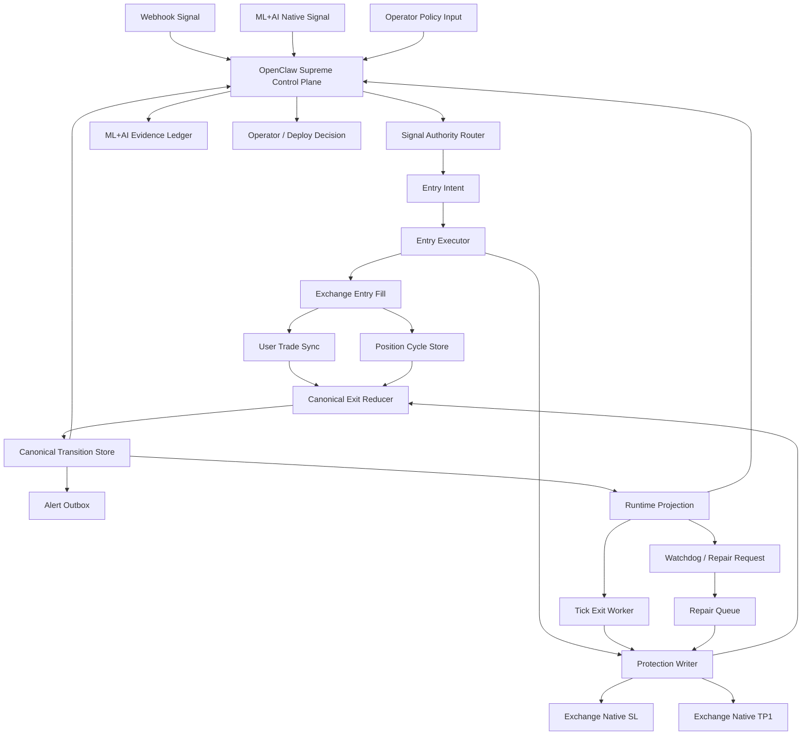

# DONBEOLJA V2 Exit Architecture

## 목표

V2 exit 엔진의 구조를 최소 구성으로 정의한다.

핵심은 아래 세 가지다.

1. stage 판단 단일화
2. 거래소 write 단일화
3. alert 생성의 후행화

그리고 이 exit 엔진 위에는 별도의 상위 제어면이 존재한다.

1. `OpenClaw Supreme Control Plane`
2. `ML+AI Native Signal Plane`

`ML+AI Native Signal Plane`은 독립 주체가 아니라 OpenClaw가 사용하는 하위 추론 계층이다.

## 시스템 개요

## 서비스 구성

### 0. OpenClaw Supreme Control Plane

V2의 최상위 시스템은 OpenClaw다.

책임:

1. signal source mode 선택
2. market / budget / risk policy 선택
3. ML+AI 판단 승인 또는 차단
4. repair policy 우선순위 결정
5. deploy / rollback 의사결정

금지:

1. exchange 직접 write
2. canonical transition 직접 write
3. fill evidence 없는 exit 사실 선언

### 1. Signal Authority Router

V2는 신호 입력을 한 군데서만 라우팅해야 한다.

지원 입력:

1. `WEBHOOK_ASSISTED`
2. `SERVER_NATIVE_ML_AI`
3. `OPENCLAW_RECOMMENDED`

책임:

1. source mode 판정
2. signal lineage 부여
3. budget / min-order / cluster risk 선검증
4. 최종 entry intent 생성

금지:

1. exit stage 해석
2. 보호주문 write
3. canonical transition 생성

### 2. Entry Executor

책임:

1. 진입 주문 제출
2. 최초 fill 수신
3. `position_cycle_id` 생성
4. 포지션 cycle 초기 문서 작성
5. protection writer 호출

금지:

1. exit stage 판단
2. trail 활성화
3. alert 직접 발행

### 3. Protection Writer

유일한 exchange write 권한자다.

책임:

1. 진입 직후 native SL 배치
2. 진입 직후 native TP1 배치
3. TP1 이후 native stop refresh
4. repair queue 처리
5. stop gap 측정

금지:

1. canonical stage 변경
2. alert 생성
3. 전략 해석 변경

출력:

1. `protection_write_id`
2. `write_phase`
3. `cancel_started_at`
4. `cancel_acked_at`
5. `place_started_at`
6. `place_acked_at`
7. `unprotected_gap_ms`

### 4. User Trade Sync

책임:

1. Binance user trades 수신
2. fill raw event 저장
3. canonical reducer에 evidence 전달

금지:

1. alert 직접 발행
2. stage 확정
3. stop write

### 5. Canonical Exit Reducer

V2의 핵심이다.

입력:

1. position cycle snapshot
2. exchange fill evidence
3. protection write result
4. runtime projection

출력:

1. canonical stage
2. canonical transition event
3. quantity ledger update
4. next runtime projection

단일 허용 transition:

1. `TP1_REACHED`
2. `TRAIL_ACTIVATED`
3. `SL_HIT`
4. `TRAIL_HIT`
5. `EXTERNAL_CLOSE_SYNC`
6. `MANUAL_CLOSE_SYNC`

### 6. Runtime Projection

실시간 운영에 필요한 projection이다.

포함 필드:

1. `stage`
2. `tp1_done`
3. `trail_active`
4. `entry_qty_abs`
5. `runner_remaining_qty_abs`
6. `runner_floor_stop`
7. `trail_stop_by_r`
8. `chosen_stop_source`
9. `chosen_stop_price`
10. `final_effective_stop`
11. `native_stop_price`
12. `health_status`

### 7. Tick Exit Worker

역할은 단순해야 한다.

책임:

1. `trail_active=true` 포지션만 순회
2. watermark 갱신
3. trail stop 계산
4. protection writer에 refresh 요청

금지:

1. TP1 판정
2. SL 판정
3. external sync 분류

### 8. Watchdog

V2 watchdog는 read-only다.

책임:

1. runtime projection과 exchange 상태 비교
2. issue code 생성
3. repair request 발행

금지:

1. 거래소 직접 수정
2. stage 재분류

repair executor는 이 request를 소비할 수는 있지만, exchange writer가 아니다.

즉, 실제 native stop / native TP1 write는 계속 protection writer 한 곳만 수행해야 한다.

### 9. ML+AI Native Signal Plane

책임:

1. 서버 독자 신호 생성
2. immutable feature snapshot 생성
3. 신호 quality scoring
4. pass / block / rank / size proposal
5. evidence ledger 기록
6. shadow vs live 성과 비교 가능성 보장
7. shadow/live proposal comparison report 생성 가능성 보장
8. webhook-assisted vs server-native comparison report 생성 가능성 보장

귀속:

1. ML+AI는 OpenClaw 하위 판단 계층이다
2. 최종 승인권은 OpenClaw에 있다

금지:

1. exit contract 임의 변경
2. native protection 우회
3. repair queue 우회
4. proposal 없이 live/canary 진입 승인 우회

### 10. Deploy Gate

배포와 승격은 replay만 통과해서는 안 된다.

입력:

1. replay report
2. shadow/live comparison report
3. 승격 모드 (`SHADOW`, `CANARY`, `LIVE`)

정책:

1. replay blocker가 있으면 항상 차단
2. comparison blocker가 있으면 항상 차단
3. `CANARY`와 `LIVE`는 comparison warning도 차단
4. `SHADOW`만 warning 허용 가능

출력:

1. unified promotion report
2. mode별 blocker / warning 집계
3. 승격 가능 여부 단일 판정

## 데이터 모델

### 1. position_cycles

문서 단위는 한 진입 cycle이다.

필수 필드:

1. `position_cycle_id`
2. `exchange`
3. `symbol`
4. `entry_event_id`
5. `entry_order_id`
6. `entry_fill_group_id`
7. `position_side`
8. `entry_price`
9. `entry_qty_abs`
10. `status`

### 2. canonical_exit_transitions_v2

필수 필드:

1. `canonical_transition_id`
2. `position_cycle_id`
3. `transition_event`
4. `previous_stage`
5. `next_stage`
6. `source_fill_id`
7. `source_order_id`
8. `entry_event_id`
9. `ledger_patch`
10. `source_exchange_evidence`
11. `created_at`

### 3. protection_runtime_v2

필수 필드:

1. `position_cycle_id`
2. `sl_order_id`
3. `tp1_order_id`
4. `native_stop_price`
5. `native_tp1_price`
6. `native_refresh_status`
7. `last_refresh_at`
8. `last_gap_ms`
9. `health_status`
10. `last_exchange_evidence`
11. `last_evidence_observed_at`

raw evidence 원칙:

1. `source_exchange_evidence` 는 canonical transition이 어떤 거래소 증거에서 만들어졌는지 남기는 snapshot이다
2. `last_exchange_evidence` 는 protection runtime이 마지막으로 어떤 거래소 증거를 반영했는지 남기는 snapshot이다
3. 두 snapshot은 최소한 `evidence_kind`, `observed_at`, `source_fill_id`, `source_order_id`, `raw_payload` 를 포함해야 한다
4. writer는 raw payload를 다시 해석해서 새로운 의미 필드를 만들지 않고 snapshot 그대로 남겨야 한다
5. reducer/alert/replay는 snapshot을 진실 원천으로 삼지 않지만, 장애 역추적과 운영 감사의 증거로는 반드시 남겨야 한다
6. replay gate와 promotion/deploy 판단은 snapshot 누락을 warning이 아니라 blocker로 처리해야 한다

### 4. exit_runtime_projection_v2

필수 필드:

1. `position_cycle_id`
2. `stage`
3. `tp1_done`
4. `trail_active`
5. `entry_qty_abs`
6. `tp1_target_qty_abs`
7. `tp1_filled_qty_abs`
8. `runner_remaining_qty_abs`
9. `runner_floor_stop`
10. `trail_stop_by_r`
11. `chosen_stop_source`
12. `chosen_stop_price`
13. `final_effective_stop`
14. `native_stop_price`
15. `health_status`

### 5. trade_alert_outbox_v2

필수 필드:

1. `alert_outbox_id`
2. `position_cycle_id`
3. `canonical_transition_id`
4. `alert_type`
5. `status`
6. `attempt_count`
7. `last_reason`
8. `sent_at`

### 6. signal_intents_v2

필수 필드:

1. `signal_intent_id`
2. `signal_source_mode`
3. `signal_lineage_id`
4. `symbol`
5. `side`
6. `quality_score`
7. `budget_check_result`
8. `min_order_check_result`
9. `decision_status`

### 7. ml_ai_evidence_ledger_v2

필수 필드:

1. `decision_id`
2. `signal_intent_id`
3. `decision_mode`
4. `features_hash`
5. `model_version`
6. `decision_summary`
7. `recommended_action`
8. `created_at`

## 표준 실행 시퀀스

### Entry

1. signal authority router가 source mode 판정
2. entry intent 생성
3. entry executor 주문 제출
4. 최초 fill ack
5. position cycle 생성
6. protection writer가 SL, TP1 배치
7. protection projection 저장

### TP1

1. Binance fill 수신
2. fill sync raw evidence 저장
3. `position_cycle.status=ACTIVE_PROTECTED` 와 protection runtime `health_status=HEALTHY`, `native_refresh_status=OK`, SL/TP1 order evidence를 확인
4. 위 보호 runtime gate가 통과한 경우에만 canonical reducer가 `TP1_REACHED` 생성
5. ledger가 `tp1_filled_qty_abs` 업데이트
6. runtime projection이 `TP1_DONE`으로 변경
7. tick exit worker가 trail 활성 가능 상태 진입
8. alert outbox가 TP1 alert 생성

TP1 금지 조건:

1. protection runtime 문서가 없으면 `TP1_REACHED` 를 쓰지 않는다
2. position cycle이 `ACTIVE_PROTECTED` 가 아니면 `TP1_REACHED` 를 쓰지 않는다
3. SL 또는 TP1 native order evidence가 없으면 `TP1_REACHED` 를 쓰지 않는다
4. protection runtime이 `HEALTHY/OK` 가 아니면 repair 대상으로 분리하고 canonical transition은 쓰지 않는다
5. fill sync wrapper는 위 차단 결과를 success처럼 삼키지 말고 `V2_SHADOW_TP1_*` skip reason과 issue code로 보존해야 한다
6. legacy `canonical_exit_transitions` 기록도 event label이 아니라 `TP1_REACHED` transition 기준으로 V2 shadow TP1 gate 성공 또는 명시적 V2 비활성 상태 없이는 쓰지 않는다
7. legacy `SL_HIT` / `TRAIL_HIT` 기록도 V2 shadow stop-exit writer 성공 또는 명시적 V2 비활성 상태 없이는 쓰지 않는다
8. legacy `EXTERNAL_CLOSE_SYNC` / `MANUAL_CLOSE_SYNC` 기록도 V2 shadow external-close writer 성공 또는 명시적 V2 비활성 상태 없이는 쓰지 않는다

중요 ledger 원칙:

1. `runner_remaining_qty_abs` 는 TP1 이후에 남는 러너 계획/잔량이다
2. `PRE_TP1` 에서는 실제 미청산 수량과 같다고 가정하면 안 된다
3. terminal exit의 `final_exit_qty_abs` 는 항상 `entry_qty_abs - tp1_filled_qty_abs` 로 계산해야 한다
4. 즉, stop/manual/external 종료는 stage 이름이 아니라 실제 누적 체결량 기준으로 최종 청산 수량을 기록해야 한다
5. shadow exit writer와 replay gate도 이 값을 그대로 소비해야 하며, 별도 재계산이나 `runner_remaining_qty_abs` 대체 사용을 하면 안 된다
6. alert worker도 terminal 전이에서 `final_exit_qty_abs` 와 `entry_qty_abs - tp1_filled_qty_abs` 가 일치하지 않으면 알림을 보내지 않고 durable failure outbox를 남겨야 한다

### Trail

1. tick exit worker가 watermark 계산
2. runner stop 계산
3. protection writer가 native stop refresh
4. projection이 chosen/final/native stop 갱신
5. stop hit fill 수신
6. reducer가 `TRAIL_HIT` 생성
7. alert 생성

## 상위 제어면 실행 시퀀스

### OpenClaw Decision Flow

1. webhook / native ML / operator policy 입력 수집
2. OpenClaw가 source mode와 policy 결정
3. signal authority router에 승인된 intent 전달
4. runtime projection / transition / watchdog evidence 재수집
5. repair / deploy / rollback decision 생성

### ML+AI Native Signal

1. feature snapshot 생성
2. ML+AI가 signal proposal 생성
3. evidence ledger 기록
4. OpenClaw가 판단 승인 또는 차단
5. signal authority router가 예산/리스크 검증
6. 통과 시 entry intent 생성

## 실패 시나리오 처리

### Case 1. SL 성공, TP1 실패

상태:

1. `health_status=DEGRADED_REPAIRABLE`
2. `tp1_order_missing=true`
3. `repair_request_required=true`

동작:

1. 포지션 유지
2. alert 발행
3. repair queue로 재무장

### Case 2. cancel 성공 후 stop refresh 실패

상태:

1. `health_status=DEGRADED_UNPROTECTED`
2. `unprotected_gap_ms` 측정 시작
3. watchdog 즉시 repair 요청

동작:

1. operator alert 발행
2. repair synchronous escalation
3. SLA 초과 시 force-safe policy 검토

### Case 3. 사용자가 UI에서 수동 청산

상태:

1. `transition_event=MANUAL_CLOSE_SYNC` 또는 `EXTERNAL_CLOSE_SYNC`
2. `status=EXITED_EXTERNAL`
3. V2 position/projection context가 없으면 legacy canonical 기록을 쓰지 않고 원인 추적 대상으로 남긴다

동작:

1. 시스템이 먹어버리지 않는다
2. 별도 canonical exit로 기록
3. 전략 exit와 분리 통계 유지

## 운영 대시보드 항목

반드시 보이는 지표:

1. active position count
2. protected position count
3. `TP1_ORDER_MISSING` count
4. `signal_source_mode` 분포
5. `SERVER_NATIVE_ML_AI` pass/block ratio
6. OpenClaw recommendation drift count
7. evidence ledger write success rate
8. OpenClaw-approved signal fill conversion
4. `NATIVE_REFRESH_UNHEALTHY` count
5. `DEGRADED_UNPROTECTED` count
6. average `unprotected_gap_ms`
7. missing `entry_event_id` count
8. alert outbox failed count

## V2 cutover 조건

아래를 만족하기 전에는 live primary로 올리지 않는다.

1. replay 100건 연속 invariant pass
2. paper 1주 무보호 포지션 0건
3. shadow alert mismatch 0건
4. canary live에서 TP1 missing 0건
5. canary live에서 silent alert drop 0건
6. LIVE promotion evidence 4종(repair Firestore streak, production entry route streak, exit runtime streak, protected-entry proof)이 같은 artifact cycle과 같은 protected position cycle을 증명
