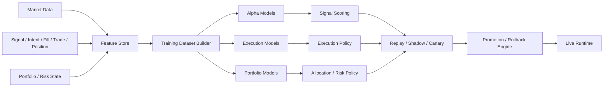

# Google-Grade ML Quant Plan

Status: ACTIVE_FOUNDATION

## Purpose
현재 `donbeolja`를 룰 중심 자동매매 시스템에서 데이터 주도형 ML 자동 퀀트 플랫폼으로 올리기 위한 설계 계획서다.

목표는 아래 3개다.

1. 방향 예측을 calibrated probability 문제로 재정의한다.
2. 실행 품질을 별도 모델 계층으로 분리한다.
3. 개별 종목 판단이 아니라 포트폴리오 최적화 문제로 승격한다.

## Target State
최종 시스템은 아래 4개 엔진이 분리된 구조여야 한다.

1. `Alpha Engine`
   - TP1 도달 확률, horizon return, regime edge를 예측한다.
2. `Execution Engine`
   - 진입 타이밍, 체결 품질, TP0/TP1/trail, time stop을 제어한다.
3. `Portfolio Engine`
   - same-side cluster, correlation, factor exposure, capital budget를 제어한다.
4. `Evaluation & Promotion Engine`
   - replay, shadow, canary, rollback, promotion을 관리한다.

## Design Principles
1. 모든 변경은 row-level 데이터셋으로 반증 가능해야 한다.
2. 모든 확률 출력은 calibration layer를 통과해야 한다.
3. 포지션은 독립 샘플이 아니라 결합된 집단 상태로 본다.
4. live는 bounded adaptation만 허용하고, 구조 변경은 검증 후 promote한다.
5. 자동 생성보다 자동 반증을 더 강하게 설계한다.

## Current Gaps
현재 시스템의 핵심 부족 요소는 아래다.

1. `training-ready SSOT` 부족
   - signal / intent / fill / trade / position / outcome / portfolio state가 한 row schema로 닫혀 있지 않다.
2. `execution microstructure model` 부족
   - slippage, latency, partial fill, reject probability를 별도 학습 문제로 다루지 않는다.
3. `portfolio optimizer` 부족
   - cluster cap은 있으나 effective exposure 기반 sizing이 없다.
4. `formal calibration` 부족
   - EV probability calibration은 시작됐지만 전 계층 공통 프로토콜은 아니다.
5. `experiment registry` 부족
   - candidate, replay, canary, promote/rollback이 더 정형화돼야 한다.

## Current Build Status
2026-04-05 기준 실제 구현 상태는 아래다.

### Done
1. `training-ready row dataset`
   - `signal / intent / fill / trade / outcome`을 row로 재구성하는 빌더가 있다.
   - raw cache direct build 경로가 있다.
2. `outcome labeling`
   - `TP0 / TP1 / time stop / pre-TP1 time stop / MFE / MAE / tp0_to_tp1_converted`가 row label로 들어간다.
3. `feature store`
   - 학습용 feature snapshot과 feature key count를 latest artifact로 저장한다.
4. `execution model dataset`
   - 전체, `entry-only`, `exit-only` 세트가 분리되어 있다.
   - `slippage / latency / partial / no-fill reason / webhook delay cause`가 정리된다.
5. `artifact versioning`
   - `dataset_version_id`, `feature_store_version_id`, `experiment_id`가 artifact에 들어간다.
6. `execution stage latency / bottleneck delta / experiment registry`
   - 단계별 latency와 version-to-version delta를 artifact로 저장한다.
7. `OpenClaw integration`
   - dataset readiness, execution bottleneck, experiment registry, execution quality를 OpenClaw가 직접 읽는다.
8. `rule-based layer 4 EV gate alignment`
   - 기존 `TP1-only` gate를 `TP_COMPOSITE_EXIT_VALUE_V1` 기준으로 재정렬했다.
   - `TP0 / TP1 / tp0_to_tp1_conversion / pre-TP1 time stop / expected exit value`를 함께 반영한다.
   - 단, 함수명과 drop reason code는 하위 호환 때문에 아직 `tp1` 이름을 일부 유지한다.

### Not Done Yet
1. 실제 `alpha model` 학습/서빙
2. 실제 `execution predictor` 학습/서빙
3. `portfolio optimizer`
4. full experiment registry with train-run metadata
5. true model promotion pipeline

## Current Interpretation Guardrails
지금 Claude나 다른 외부 검수자가 가장 많이 틀리기 쉬운 부분은 아래다.

1. `execution bottleneck`는 historical legacy noise와 current runtime bottleneck을 구분해야 한다.
   - old webhook rows 중 일부는 `immediate probe`가 없어서 `LEGACY_WEBHOOK_OUTCOME_ONLY`로 별도 분리된다.
   - 이 값은 “현재 즉시 실행 병목”이 아니라 “옛 샘플의 관측 한계”를 뜻할 수 있다.
2. `execution_bottleneck_delta`
   - 같은 `experiment_id` 또는 같은 `dataset_version_id + feature_store_version_id` 재생성은 `STALE_COMPARISON`이다.
   - `delta=0`을 즉시 “개선 없음”으로 읽으면 안 된다.
3. `operational-only` 집계
   - `PINE_WEBHOOK`, `MANUAL_REPLAY`, `PAPER_RUNTIME`는 운영 병목 집계에서 제외한다.
4. `OpenClaw`
   - raw full-system learner가 아니라 curated full-ops learner다.
   - latest artifact와 상위 summary를 우선으로 읽어야 한다.
5. `filter vs ML`
   - 현재 단계는 hard filter replacement가 아니라 ML foundation build다.
   - existing hard gate와 future ML score를 혼동하면 안 된다.

## Target Architecture

## Data Plane Requirements
반드시 row-level lineage가 닫혀야 한다.

필수 필드:
1. market snapshot
   - OHLCV, ATR, volatility regime, spread/liquidity proxy
2. signal snapshot
   - signal_id, score, EV lower bound, regime, cohort
3. execution snapshot
   - intent_id, latency, slippage, partial fill, fee, reject reason
4. outcome snapshot
   - TP0/TP1/SL/time stop, MFE/MAE, TP1-first, horizon return
5. portfolio snapshot
   - simultaneous positions, same-side cluster, correlated exposure

완료 조건:
각 executed row가 `why entered`, `how executed`, `how exited`, `what would have happened otherwise`를 재구성 가능해야 한다.

## Model Stack
### 1. Alpha
1. TP1 probability model
2. SL probability model
3. horizon return model
4. uncertainty model
5. regime-conditioned ensemble

### 2. Execution
1. entry quality model
2. slippage model
3. partial fill model
4. latency cost model
5. TP0 -> TP1 conversion model

### 3. Portfolio
1. cluster graph
2. effective exposure model
3. dynamic sizing model
4. intraday VaR / CVaR
5. regime stress allocator

## Evaluation Framework
모든 후보 변경은 아래 단계를 거친다.

1. offline replay
2. shadow challenger
3. canary
4. staged promote
5. rollback-only path

승격 기준:
1. objective score 개선
2. calibration degradation 없음
3. execution cost 악화 없음
4. portfolio risk budget 내
5. 신규 failure mode 증가 없음

## OpenClaw Role
OpenClaw는 raw full-system learner가 아니라 curated full-ops learner로 유지한다.

직접 담당:
1. candidate generation
2. evidence aggregation
3. contradiction detection
4. bounded auto-mutation
5. promotion / rollback recommendation

직접 금지:
1. 승인 없는 대규모 live strategy rewrite
2. unlimited self-modifying deploy
3. risk budget override

## 90-Day Build Plan
### Phase 1. Data Foundation
기간: 2~4주

목표:
- unified learning dataset schema 확정
- signal-intent-fill-trade-position lineage 완성
- outcome labeling 자동화

산출물:
- `training_dataset_latest.jsonl` 또는 parquet pipeline
- feature dictionary
- lineage validator

### Phase 2. Execution Intelligence
기간: 3~5주

목표:
- TP0/TP1/trail/time stop KPI를 정식 학습 입력화
- slippage / latency / partial fill 모델 구축

산출물:
- execution-quality feature set
- TP0->TP1 conversion report
- execution-adjusted expectancy report

### Phase 3. Alpha ML
기간: 4~8주

목표:
- EV/TP1 score를 calibrated probability 체계로 재구축

산출물:
- TP1 probability model
- calibration report
- regime-wise reliability curve

### Phase 4. Portfolio Optimization
기간: 3~6주

목표:
- cluster cap을 effective exposure optimizer로 승격

산출물:
- correlation graph
- dynamic sizing policy
- portfolio risk budget engine

### Phase 5. Experiment Platform
기간: 4~6주

목표:
- candidate -> replay -> canary -> promote 흐름을 정형화

산출물:
- candidate registry
- experiment registry
- promotion checklist
- rollback audit

## Phase 1 Kickoff
가장 먼저 시작할 일은 아래다.

1. unified row schema 정의
2. row-level outcome labeling pipeline 구축
3. feature store 저장 포맷 결정
4. TP0/TP1/trail/time stop KPI를 retrospective에서 row-level로 재수집
5. execution quality feature lineage 보강

## Phase 1 Actual Progress
현재 코드베이스 기준으로 Phase 1은 아래까지 진행됐다.

1. `mlDatasetSchema`
2. `outcomeLabeler`
3. `build-ml-training-dataset`
4. `mlFeatureStore`
5. `modelReadiness`
6. `build-ml-execution-dataset`
7. `executionStageLatency`
8. `mlExperimentRegistry`
9. `executionBottleneckDelta`

남은 것:
1. webhook probe history를 기반으로 legacy/current delay를 더 정확히 분리
2. baseline train metadata를 registry에 연결
3. model-ready snapshot retention and split policy 강화

## Phase 1 Work Breakdown
### A. Dataset Schema
필수 파일:
1. `src/utils/mlDatasetSchema.js`
2. `scripts/build-ml-training-dataset.js`
3. `src/tests/ml-dataset-schema.test.js`

### B. Outcome Labeler
필수 파일:
1. `src/services/outcomeLabeler.js`
2. `src/tests/outcome-labeler.test.js`

### C. Feature Store
필수 파일:
1. `src/storage/featureStore.js`
2. `scripts/backfill-feature-store.js`
3. `src/tests/feature-store.test.js`

### D. OpenClaw Integration
필수 파일:
1. `scripts/report-best-self-evolution-model-readiness.js`
2. `src/utils/openclawAutonomyContract.js`
3. `src/utils/openclawReasoningJournal.js`

## Success Criteria
이 계획이 제대로 가고 있으면 아래가 보여야 한다.

1. TP0/TP1/SL/time stop row-level labels complete
2. execution-quality metrics become model inputs, not only reports
3. calibrated probability reliability improves
4. cluster risk becomes optimizer input, not only hard block
5. promotion decisions become evidence-first

## Immediate Decision
현재 코드베이스 기준 최우선순위는 아래다.

1. `training-ready SSOT`
2. `execution microstructure model`
3. `portfolio effective exposure engine`

핵심은 더 많은 rule을 더하는 것이 아니라, 운영 데이터를 재사용 가능한 학습 문제로 바꾸는 것이다.

## Claude Audit Input
Claude가 이 계획서와 현재 구현 상태를 올바르게 이해하려면 아래 문서를 함께 읽어야 한다.

1. `/Users/jeongjaeyong/Projects/donbeolja/docs/BEST_SELF_EVOLUTION_MASTER_SPEC.md`
2. `/Users/jeongjaeyong/Projects/donbeolja/docs/DONBEOLJA_SYSTEM_ARCHITECTURE.md`
3. `/Users/jeongjaeyong/Projects/donbeolja/docs/OPENCLAW_AUTONOMY_CONTRACT.md`
4. `/Users/jeongjaeyong/Projects/donbeolja/docs/CLAUDE_GOOGLE_GRADE_ML_QUANT_AUDIT_PROMPT_2026-04-05.md`
