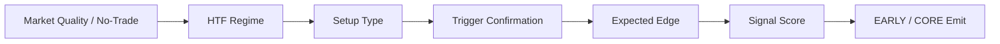

# SIGNAL_V7_0_0_0_SYSTEM_SPEC

- 제정: 2026-04-24
- 상태: DRAFT
- 성격: CURRENT V2 SIGNAL SYSTEM VISUAL OVERLAY
- 설계 파일:
  - `/Users/jeongjaeyong/Projects/donbeolja/code/donbeolja_v7.0.0.0_SIGNAL_REDESIGN.pine.txt`
- production candidate:
  - `/Users/jeongjaeyong/Projects/donbeolja/code/donbeolja_v7.0.0.0_PRODUCTION_CANDIDATE.pine.txt`
- TradingView import final:
  - `/Users/jeongjaeyong/Projects/donbeolja/code/donbeolja_v7.0.0.0_TV_IMPORT_FINAL.pine.txt`
- 연계 SSOT:
  - `/Users/jeongjaeyong/Projects/donbeolja/src/v2/signalCriteria.js`
  - `/Users/jeongjaeyong/Projects/donbeolja/src/v2/signalRegimeProfile.js`
  - `/Users/jeongjaeyong/Projects/donbeolja/src/v2/expectedEdgeModel.js`

## 1. 목적

`돈벌자 v7`의 목적은 서버 V2 신호 시스템을 TradingView 차트 위에서 설명 가능한 시각 오버레이로 재구성하는 것이다.

핵심 목표는 4개다.

1. `동일 철학`
- 서버에서 쓰는 `no_trade -> htf -> setup -> trigger -> expected_edge` 계약을 Pine에서도 같은 순서로 보여준다.

2. `설명 가능성`
- 왜 막혔는지, 어떤 cohort인지, 왜 CORE/EARLY가 나왔는지 차트에서 바로 읽을 수 있게 한다.

3. `시각화 우선`
- Pine는 서버 실행기 자체가 아니라 설명 레이어다. 따라서 실시간 market/funding/mark-index는 가능한 범위에서 proxy로 계산하고, 그 사실을 명시한다.

4. `운영 계약 유지`
- 외부 alert surface는 `LONG_CORE / LONG_EARLY / SHORT_CORE / SHORT_EARLY` 네 개만 유지한다.

## 2. V7 구조

## 3. Gate 정의

### 3.1 No-Trade Gate
- `market_quality_score >= 0.70`
- `spread_proxy_bps <= 8`
- `mark_index_gap_proxy_bps <= 10`
- `funding_penalty_bps <= 3`
- `RANGE` 구조는 기본 차단

### 3.2 HTF Gate
- `htf_regime == LONG|SHORT`
- `trend_alignment_local >= 0.60`

### 3.3 Setup Gate
- `setup_type = PULLBACK_RECLAIM | BREAKOUT_RETEST`
- `setup_quality >= 0.60`
- 방향 정렬만으로 setup을 자동 합성하지 않는다.

### 3.4 Trigger Gate
- `trigger_confirmed == true`
- `volume_zscore >= 1.0`
- `RSI >= 55` (LONG) / `<= 45` (SHORT)

### 3.5 Expected Edge Gate
- `expected_gross_r >= 1.8`
- `expected_net_r_after_cost >= 0.25`
- `edge_cohort != NEGATIVE_EDGE`
- `gross/net/cost`는 Pine 내부에서 일관된 식으로 계산한다.

## 4. Score 모델

V7 score는 단순 gate 재표현이 아니라 연속값이다.

- Market quality: 15
- HTF alignment: 25
- Setup quality: 20
- Trigger strength: 20
- Edge score: 20

합계는 `0..100`이고,
- `EARLY >= 64`
- `CORE >= 78`

## 5. Visualization 계약

차트에서 반드시 보여야 하는 것:

1. EMA ribbon
2. 구조 레짐 배경 (`TREND / TRANSITION / RANGE`)
3. `LC / LE / SC / SE` marker
4. 하단 패널
   - regime
   - regime cohort
   - market quality / spread
   - long/short setup
   - long/short trigger
   - long/short edge cohort + net R
   - long/short score
   - no-trade / HTF gate
   - block reason
5. 신호 바 label
   - direction
   - grade
   - setup type
   - edge cohort
   - score

## 6. Payload 계약

최소 포함 필드:

1. `strategy_id = donbeolja_v7.0.0.0`
2. `engine_mode = SIGNAL_CRITERIA_V7_VISUAL`
3. `event = LONG | SHORT`
4. `entry_grade = CORE | EARLY`
5. `setup_type`
6. `structural_regime`
7. `regime_cohort`
8. `edge_cohort`
9. `signal_score`
10. `expected_gross_r`
11. `expected_net_r_after_cost`
12. `tp1_reach_probability`
13. `stop_hit_probability`
14. `no_trade_gate`
15. `htf_gate`
16. `setup_gate`
17. `trigger_gate`
18. `expected_edge_gate`
19. `block_reason`

## 7. Proxy 한계

Pine는 서버처럼 외부 실시간 microstructure를 직접 읽지 못한다. 따라서 아래는 proxy다.

- `spread_bps`
- `mark_index_gap_bps`
- `funding_penalty_bps` (manual input)

즉 V7 Pine는 `execution authority`가 아니라 `signal visualization authority`다.

## 8. 최종 의미

`돈벌자 v7`는 v6의 단순 opportunity / trigger / risk 패널이 아니라,
현재 서버 V2 신호 시스템을 차트 위에서 cohort와 gate 단위로 읽게 만드는 설명 계층이다.
